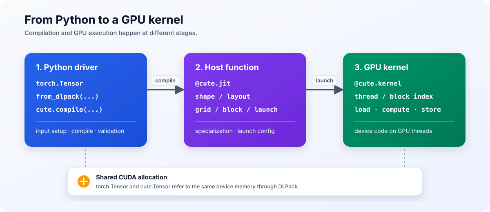

# CuTe DSL Tutorial

CUDA kernel을 작성해 본 독자를 위한 한국어 CuTe DSL 교재입니다. 목표는 CuTe의 출력에서 `Shape:Stride`를 읽고, thread와 data의 mapping을 추적하고, elementwise kernel과 reduction에서 Blackwell GEMM까지 직접 구현하는 것입니다.

Part 1에서 `Shape`, `Layout`, `Tensor`를 세 장 안에 정리합니다. Part 2부터는 매 장마다 실행 가능한 kernel을 확장하면서 새로운 개념을 도입합니다. Layout algebra는 실제 코드에 필요한 순서로 설명하고, 세부 연산은 부록에 모읍니다.



## 필요한 배경

- CUDA grid, block, thread, warp
- global memory, shared memory, register
- coalescing과 bank conflict
- `__syncthreads()`와 기본적인 synchronization
- 행렬곱 `C = A @ B`

CUTLASS C++ template이나 Tensor Core instruction을 미리 알 필요는 없습니다. 예제는 Linux, Python 3.12, CuTe DSL 4.6.1에서 검증합니다.

설치와 코드를 읽는 순서는 [00. 시작하기](book/00-reading-guide.md)에 정리했습니다.

## Learning path

### Part 1. CuTe 기본 개념

- [x] [01. First kernel and execution model](book/01-execution-model.md)
- [x] [02. Shape, Stride, and Layout](book/02-shape-stride-layout.md)
- [x] [03. Tensor, slicing, and tiling](book/03-tensor-slicing-tiling.md)

Part 1을 마치면 `(M, N):(N, 1)` 같은 Layout을 읽고, Tensor slicing과 tiling이 base offset과 Layout을 어떻게 바꾸는지 계산할 수 있어야 합니다.

### Part 2. Fundamental GPU kernels

- [x] [04. Vector addition: scalar and vectorized kernels](book/04-vector-add.md)
- [x] [05. Warp and block reduction](book/05-reduction.md)
- [x] [06. Shared-memory transpose](book/06-shared-memory-transpose.md)
- [x] [07. Row-wise softmax](book/07-row-softmax.md)

Vector addition, reduction, transpose, softmax를 직접 구현합니다. Vectorized memory access, warp shuffle, shared-memory Layout, synchronization, predication, runtime loop를 필요한 시점에 도입합니다.

### Part 3. Building a Tensor Core GEMM

- [ ] 08. MMA atom and TiledMMA
- [ ] 09. First tiled Tensor Core GEMM
- [ ] 10. Multistage GEMM and epilogue

Part 2에서 사용한 thread partitioning, vectorized memory access, shared-memory staging을 GEMM에 적용합니다. 각 단계에서 accumulator Layout과 GMEM → SMEM → RMEM dataflow를 코드와 함께 추적합니다.

### Part 4. Asynchronous pipelines and modern architectures

- [ ] 11. TMA and `mbarrier`
- [ ] 12. Warp-specialized and persistent pipelines
- [ ] 13. Hopper WGMMA
- [ ] 14. Blackwell TMEM and `tcgen05`
- [ ] 15. Thread block clusters and 2-SM MMA

Part 3의 GEMM에 TMA pipeline과 Hopper·Blackwell instruction을 차례로 적용합니다. 두 architecture에서 memory와 execution model이 어떻게 달라지는지 code로 비교합니다.

### Part 5. Complete kernels

- [ ] 16. Blackwell GEMM end to end
- [ ] 17. NVFP4 block-scaled GEMM
- [ ] 18. Grouped GEMM and MoE case study

앞에서 만든 구성 요소를 완전한 kernel로 조립하고, dense GEMM에서 block-scaled GEMM과 grouped GEMM으로 범위를 넓힙니다.

### Appendices

- [ ] A. Layout algebra reference
- [ ] B. Correctness and numerical error
- [ ] C. Reading IR, PTX, and SASS
- [ ] D. Profiling with Nsight Compute
- [ ] E. PyTorch, DLPack, and AOT integration

## 예제 실행

```bash
source ~/workspace/.venv_wsl/bin/activate
python examples/01_execution_model/vector_add.py
```

## References and figures

기술적인 설명은 현재 NVIDIA documentation과 CUTLASS source를 기준으로 작성합니다. Colfax Research를 비롯한 논문과 technical blog는 Layout 설명, kernel 구성, 최적화 사례를 비교하는 데 사용합니다.

장별 source와 figure 원본은 [References](references/sources.md)에 기록합니다. 저장소에 포함된 third-party asset의 license는 [Third-party notices](THIRD_PARTY_NOTICES.md)에서 확인할 수 있습니다.
