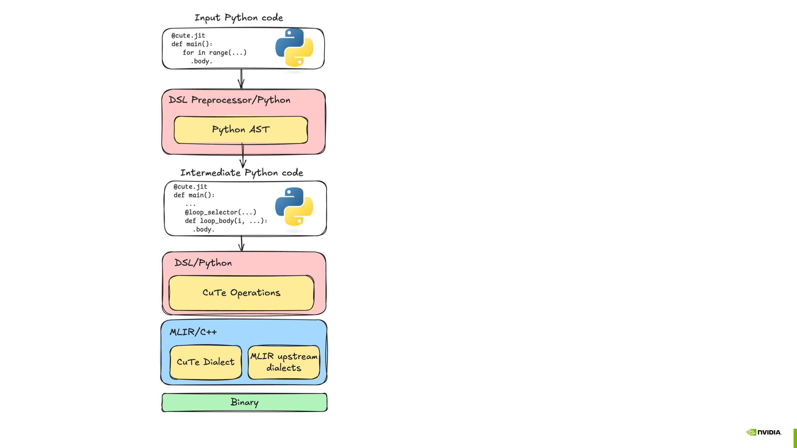

# 01. Python에서 GPU kernel까지

첫 CuTe DSL 프로그램을 이해하려면 계산식보다 실행 경계를 먼저 구분해야 합니다. 한 `.py` 파일 안에 일반 Python, JIT로 생성되는 host code, GPU에서 실행되는 kernel이 함께 있기 때문입니다.


*그림 1-1. 이 책에서 다시 구성한 CuTe DSL의 실행 경계. Python driver, JIT host function, GPU kernel이 실행되는 위치를 구분한다.*

## 세 종류의 코드

아래 세 영역은 실행 시점과 역할이 다릅니다.

| 영역 | 대표 코드 | 실행 위치 | 역할 |
|---|---|---|---|
| Python driver | PyTorch tensor 생성, `cute.compile` | CPU의 Python process | 입력 준비, compile 요청, 검증 |
| JIT host function | `@cute.jit` | CPU | kernel specialization과 launch 구성 |
| GPU kernel | `@cute.kernel` | GPU | thread별 load, compute, store |

`@cute.kernel` 함수는 Python에서 직접 호출하지 않습니다. `@cute.jit` 함수가 kernel call을 만들고 `.launch()`에 grid와 block을 전달합니다. 그 `@cute.jit` 함수를 `cute.compile`로 specialize하면 Python에서 호출할 수 있는 compiled function을 얻습니다.

이 관계를 가장 작은 vector addition으로 확인해 보겠습니다.

## 전체 예제

실행 파일은 [`examples/01_execution_model/vector_add.py`](../examples/01_execution_model/vector_add.py)에 있습니다.

```python
import torch
from cutlass import cute
from cutlass.cute.runtime import from_dlpack


@cute.kernel
def vector_add_kernel(
    a: cute.Tensor,
    b: cute.Tensor,
    out: cute.Tensor,
):
    tid, _, _ = cute.arch.thread_idx()
    bid, _, _ = cute.arch.block_idx()
    bdim, _, _ = cute.arch.block_dim()
    i = bid * bdim + tid

    if i < cute.size(out):
        out[i] = a[i] + b[i]


@cute.jit
def vector_add(
    a: cute.Tensor,
    b: cute.Tensor,
    out: cute.Tensor,
):
    threads = 256
    blocks = cute.ceil_div(cute.size(out), threads)
    vector_add_kernel(a, b, out).launch(
        grid=(blocks, 1, 1),
        block=(threads, 1, 1),
    )
```

CUDA C++의 elementwise kernel과 index 계산은 같습니다. 차이는 pointer 대신 `cute.Tensor`를 받고, kernel launch가 `@cute.jit` 함수 안에 있다는 점입니다.

## 1. PyTorch tensor는 복사되지 않는다

host code에서는 PyTorch tensor를 DLPack을 통해 CuTe tensor로 바꿉니다.

```python
a_cute = from_dlpack(a, assumed_align=16).mark_layout_dynamic()
b_cute = from_dlpack(b, assumed_align=16).mark_layout_dynamic()
out_cute = from_dlpack(out, assumed_align=16).mark_layout_dynamic()
```

여기서 device-to-device copy는 일어나지 않습니다. 두 framework가 같은 CUDA allocation을 가리키는 tensor view를 공유합니다. 따라서 CuTe kernel이 `out_cute`에 기록한 결과를 PyTorch의 `out`에서 바로 확인할 수 있습니다.

`assumed_align=16`은 base address가 16-byte aligned라는 compile-time 가정입니다. 이 인자는 pointer를 정렬해 주지 않습니다. 실제 allocation이 조건을 만족할 때만 지정해야 합니다.

`mark_layout_dynamic()`은 runtime tensor의 shape와 stride를 compiled function에 전달하도록 만듭니다. 이를 생략하면 구체적인 layout 정보가 specialization의 일부가 될 수 있습니다. 어느 정보를 static으로 둘지는 뒤의 Layout 장에서 다시 다룹니다.

## 2. `cute.compile`은 kernel 실행이 아니다

```python
compiled = cute.compile(vector_add, a_cute, b_cute, out_cute)
```

이 호출은 `vector_add`와 인자 type을 기준으로 host launcher와 GPU kernel을 compile합니다. compile time을 kernel latency에 포함하면 안 됩니다.

실제 GPU 작업 제출은 compiled function을 호출할 때 일어납니다.

```python
compiled(a_cute, b_cute, out_cute)
```

동일한 signature를 다시 compile하면 JIT cache를 재사용할 수 있습니다. 반대로 dtype, static shape, layout, `Constexpr` 값이 달라지면 새로운 specialization이 만들어질 수 있습니다.

### Python 함수가 GPU binary가 되기까지

`cute.compile` 내부에서는 Python source를 곧바로 CUDA C++ source로 번역하지 않습니다. CuTe DSL 전처리기가 decorator가 붙은 함수의 Python AST를 분석하고, DSL 연산을 추적해 CuTe dialect를 포함한 MLIR module을 만듭니다. 이후 NVIDIA CUDA toolchain을 거쳐 실행할 binary가 생성됩니다.



*그림 1-2. CuTe DSL compilation pipeline. 출처: [NVIDIA CUTLASS documentation](https://github.com/NVIDIA/cutlass/blob/main/media/docs/pythonDSL/cute_dsl_general/dsl_compilation.png), Copyright © 2017–2026 NVIDIA Corporation, [BSD-3-Clause](../THIRD_PARTY_NOTICES.md#nvidia-cutlass-documentation-figure).*

그림의 두 경로는 섞여 실행되는 것이 아니라 순서대로 이어집니다.

1. **DSL preprocessor**가 Python AST를 변환합니다. Python control flow 가운데 compile 시점에 처리할 부분과 IR에 남길 부분이 여기서 구분됩니다.
2. **Tracing**이 CuTe 연산을 MLIR의 CuTe dialect와 upstream dialect로 기록합니다.
3. **Code generation**이 대상 GPU에서 실행할 binary를 만듭니다.

`@cute.jit`의 기본값인 `preprocess=True`는 AST rewrite와 tracing을 함께 사용합니다. `preprocess=False`는 tracing만 수행하므로 compile은 단순해지지만, 실행되지 않은 branch가 사라지고 loop가 trace 당시 횟수만큼 펼쳐질 수 있습니다. 처음에는 기본값을 유지하고 두 방식의 차이는 control flow 장에서 실험합니다.

따라서 오류가 발생한 위치도 나누어 봐야 합니다. 일반 Python 예외인지, DSL compile 오류인지, 생성된 GPU kernel의 runtime 오류인지에 따라 확인할 자료가 다릅니다. 32장에서는 IR, PTX, SASS를 이 단계에 맞춰 추적합니다.

## 3. `@cute.jit`은 launch 조건을 정한다

```python
threads = 256
blocks = cute.ceil_div(cute.size(out), threads)
```

`threads`는 CTA당 thread 수입니다. `blocks`는 tensor의 모든 원소를 덮는 CTA 수입니다. 원소 수가 256의 배수가 아니면 마지막 CTA의 일부 thread는 유효 범위를 벗어납니다.

예제의 기본 크기는 4099입니다.

```text
ceil(4099 / 256) = 17 CTAs
17 × 256         = 4352 threads
4352 - 4099      = 253 inactive threads in the final CTA
```

따라서 kernel 안의 predicate가 필요합니다.

```python
if i < cute.size(out):
    out[i] = a[i] + b[i]
```

이 조건을 제거하면 마지막 CTA가 allocation 범위를 벗어나 접근합니다.

## 4. `cute.Tensor`가 pointer보다 많은 정보를 갖는 이유

이 예제에서는 `a[i]`처럼 1차원 index만 사용합니다. 그래도 `a`는 pointer가 아니라 `Tensor`입니다. CuTe의 Tensor는 storage를 가리키는 engine과 논리 coordinate를 address offset으로 바꾸는 Layout을 함께 가집니다.

```text
logical coordinate i
        │
        ▼
     Layout(i)
        │
        ▼
storage offset → load/store
```

현재 Layout은 단순한 contiguous 1D mapping입니다. 이후 장에서는 같은 `Tensor` interface를 유지한 채 `(row, col)` matrix, hierarchical tile, swizzled shared memory를 표현합니다. 이 점이 CuTe code를 단순 pointer arithmetic과 구분합니다.

## 5. correctness를 먼저 확인한다

```python
compiled(a_cute, b_cute, out_cute)
torch.cuda.synchronize()
torch.testing.assert_close(out, a + b, rtol=0, atol=0)
```

FP32 addition 한 번만 수행하므로 PyTorch reference와 정확히 같은 값을 기대할 수 있습니다. 연산 순서가 달라지는 reduction이나 GEMM에서는 dtype과 accumulation 순서를 반영해 tolerance를 정해야 합니다.

실행:

```bash
python examples/01_execution_model/vector_add.py
```

shape를 바꿔 마지막 CTA와 여러 CTA를 모두 확인할 수 있습니다.

```bash
python examples/01_execution_model/vector_add.py --size 17
python examples/01_execution_model/vector_add.py --size 4096
python examples/01_execution_model/vector_add.py --size 4099
python examples/01_execution_model/vector_add.py --size 1048576
```

## 생성된 코드를 확인하는 방법

CuTe DSL은 compile 결과의 IR, PTX, CUBIN을 확인할 수 있습니다. 처음에는 IR 전체를 읽을 필요가 없습니다. kernel 이름, thread index, global load/store가 생성됐는지만 확인합니다.

```bash
CUTE_DSL_PRINT_IR=1 \
python examples/01_execution_model/vector_add.py --size 17
```

별도 파일로 저장하려면 dump directory를 지정합니다.

```bash
mkdir -p build/dump
CUTE_DSL_KEEP=ir,ptx,cubin \
CUTE_DSL_DUMP_DIR=build/dump \
python examples/01_execution_model/vector_add.py
```

`CUTE_DSL_KEEP`에는 `ir-debug`, `sass`, `all`도 지정할 수 있습니다. SASS 생성에는 DSL package의 `sass` extra나 생성된 CUBIN과 호환되는 `nvdisasm`이 필요합니다. debug option은 cache key와 생성 code에 영향을 줄 수 있으므로 성능 측정은 option을 끈 상태에서 다시 해야 합니다.

## 확인할 질문

1. `from_dlpack` 호출에서 CUDA memory copy가 일어나는가?
2. `cute.compile`과 `compiled(...)` 가운데 어느 호출이 GPU 작업을 제출하는가?
3. size가 4099일 때 grid에 몇 개의 CTA가 필요한가?
4. `assumed_align=16`이 실제 pointer를 정렬해 주는가?
5. `@cute.kernel`을 일반 Python 함수처럼 직접 호출할 수 있는가?

답은 각각 **아니다**, **`compiled(...)`**, **17개**, **아니다**, **아니다**입니다.

## 다음 장

다음 장에서는 `cute.Tensor`의 주소 계산을 담당하는 `Shape`, `Stride`, `Layout`을 작은 정수 예제로 분해합니다. GPU code를 쓰기 전에 `Layout(coord) = offset`을 손으로 계산할 수 있게 만드는 것이 목표입니다.

## 참고 자료

- [NVIDIA CuTe DSL Introduction](https://docs.nvidia.com/cutlass/latest/media/docs/pythonDSL/cute_dsl_general/dsl_introduction.html)
- [NVIDIA End-to-End Code Generation](https://docs.nvidia.com/cutlass/latest/media/docs/pythonDSL/cute_dsl_general/dsl_code_generation.html)
- [NVIDIA CuTe DSL Quick Start Guide](https://docs.nvidia.com/cutlass/latest/media/docs/pythonDSL/quick_start.html)
- [NVIDIA CuTe DSL Educational Notebooks](https://docs.nvidia.com/cutlass/latest/media/docs/pythonDSL/guides/notebooks.html)
- [NVIDIA CuTe DSL Debugging Guide](https://docs.nvidia.com/cutlass/latest/media/docs/pythonDSL/guides/debugging.html)
