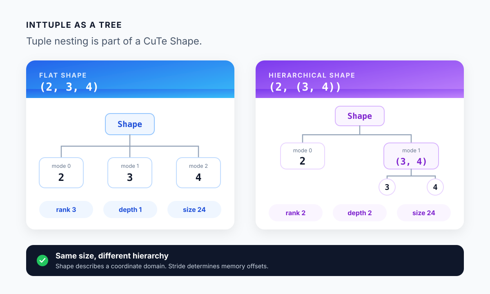
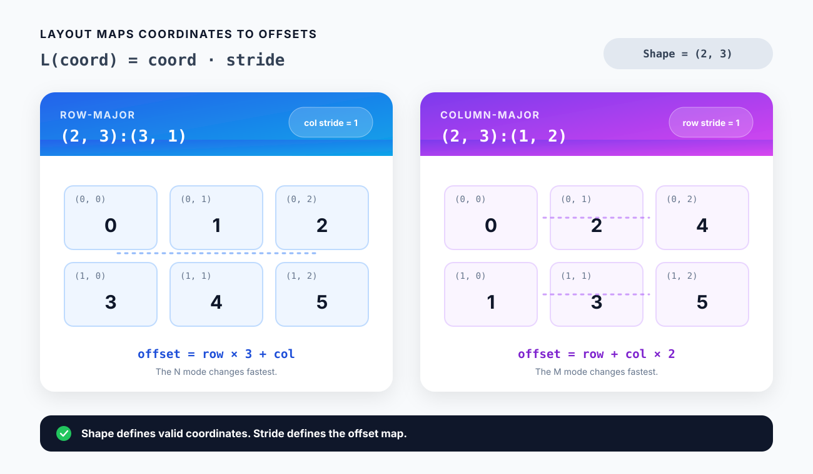

# 02. Shape, Stride, and Layout

CuTe의 `Layout`은 좌표를 메모리 offset으로 바꾸는 함수입니다. 행렬의 원소 `(m, n)`을 읽는다고 하면, `Layout`이 먼저 `(m, n)`을 정수 offset으로 변환하고 `Tensor`가 그 위치의 값을 읽습니다.

```text
Layout = Shape + Stride

coordinate ── Layout ──> element offset
```

`Shape`는 사용할 수 있는 좌표의 범위를 정하고, `Stride`는 각 좌표 성분이 offset에 얼마나 기여하는지 정합니다. 이 장에서는 작은 정수만 사용해 두 값을 직접 계산합니다.

## Shape은 좌표의 범위다

평범한 2차원 Shape `(2, 3)`의 좌표는 다음 여섯 개입니다.

```text
(0, 0)  (0, 1)  (0, 2)
(1, 0)  (1, 1)  (1, 2)
```

CuTe의 `Shape`는 flat tuple에 한정되지 않습니다. 각 mode가 다시 여러 mode를 포함할 수 있습니다.

```text
(2, 3, 4)       flat Shape
(2, (3, 4))     hierarchical Shape
```

두 Shape의 원소 수는 24로 같지만 구조는 다릅니다. 이 계층은 뒤에서 CTA tile을 warp와 thread에 나누거나, 한 thread가 처리할 여러 값을 묶을 때 사용합니다.



*Figure 2-1. `(2, 3, 4)`와 `(2, (3, 4))`는 size가 같지만 rank와 depth가 다르다.*

### IntTuple

CuTe에서 `IntTuple`은 integer 하나이거나 다른 `IntTuple`을 원소로 갖는 tuple입니다.

```text
IntTuple := Integer | tuple[IntTuple, ...]
```

따라서 `6`, `(2, 3)`, `(2, (3, 4))`는 모두 `IntTuple`입니다. `Shape`, `Stride`, coordinate가 같은 재귀 구조를 사용하기 때문에 mode별 관계를 그대로 유지한 채 Layout을 변환할 수 있습니다.

### Rank, depth, and size

Shape의 구조는 `rank`, `depth`, `size`로 확인합니다.

| Shape | `rank` | `depth` | `size` |
|---|---:|---:|---:|
| `6` | 1 | 0 | 6 |
| `(6,)` | 1 | 1 | 6 |
| `(2, 3, 4)` | 3 | 1 | 24 |
| `(2, (3, 4))` | 2 | 2 | 24 |

- `rank(x)`는 가장 바깥쪽 mode의 수입니다.
- `depth(x)`는 tuple이 중첩된 최대 단계입니다.
- `size(x)`는 모든 leaf를 곱한 값입니다.

`rank`는 leaf의 개수가 아닙니다. `(2, (3, 4))`의 바깥쪽에는 `2`와 `(3, 4)` 두 mode가 있으므로 rank는 2입니다.

```python
shape = (2, (3, 4))

assert cute.rank(shape) == 2
assert cute.depth(shape) == 2
assert cute.size(shape) == 24
assert cute.size(shape, mode=[1]) == 12
```

`cute.get()`은 mode 경로를 따라 일부를 선택합니다.

```python
assert cute.get(shape, mode=[0]) == 2
assert cute.get(shape, mode=[1]) == (3, 4)
assert cute.get(shape, mode=[1, 0]) == 3
```

`mode=[1, 0]`은 바깥쪽 mode 1을 선택한 뒤 그 안의 mode 0을 선택한다는 뜻입니다.

## Stride가 offset을 정한다

Flat rank-2 Layout의 coordinate를 `(c0, c1)`, Stride를 `(d0, d1)`이라고 하면 offset은 다음과 같습니다.

```text
offset = c0 × d0 + c1 × d1
```

Shape `(2, 3)`에 Stride `(3, 1)`을 붙여 보겠습니다.

```text
(2, 3):(3, 1)
```

CuTe는 Layout을 `Shape:Stride` 형식으로 출력합니다. 좌표 `(1, 2)`의 offset은 `1 × 3 + 2 × 1 = 5`입니다. 두 번째 mode의 stride가 1이므로 같은 행에서 열을 하나 옮길 때 offset도 1 증가합니다. 일반적인 row-major Layout입니다.

같은 Shape에 Stride `(1, 2)`를 붙이면 결과가 달라집니다.

```text
(2, 3):(1, 2)
```

이번에는 첫 번째 mode의 stride가 1입니다. 행을 하나 옮길 때 offset이 1 증가하는 column-major Layout입니다.



*Figure 2-2. 같은 Shape도 Stride에 따라 coordinate-to-offset mapping이 달라진다.*

Python에서는 `cute.make_layout()`으로 두 Layout을 만듭니다.

```python
shape = (2, 3)
row_major = cute.make_layout(shape, stride=(3, 1))
column_major = cute.make_layout(shape, stride=(1, 2))

assert cute.crd2idx((1, 1), row_major) == 4
assert cute.crd2idx((1, 1), column_major) == 3
```

`cute.crd2idx()`는 coordinate와 Layout을 받아 element offset을 계산합니다. 실제 byte address는 element type까지 알아야 정할 수 있습니다.

```text
byte address = base address + element offset × sizeof(element)
```

따라서 Layout의 Stride는 byte 단위가 아니라 element 단위입니다.

## 기본 Layout은 left-major다

Stride를 생략한 `cute.make_layout(shape)`은 가장 왼쪽 mode가 가장 빠르게 변하는 compact Layout을 만듭니다.

```python
layout = cute.make_layout((2, 3))
print(layout)  # (2, 3):(1, 2)
```

Flat matrix에서는 column-major에 해당합니다. Python과 PyTorch의 row-major 배열에 익숙하면 `(3, 1)`을 예상하기 쉬우므로, memory order가 중요한 code에서는 Stride를 명시하는 편이 안전합니다.

Mode가 변하는 순서를 직접 지정하려면 `cute.make_ordered_layout()`을 사용할 수 있습니다. `order`는 가장 빠르게 변하는 mode부터 나열합니다.

```python
row_major = cute.make_ordered_layout((2, 3), order=(1, 0))
column_major = cute.make_ordered_layout((2, 3), order=(0, 1))

assert row_major.stride == (3, 1)
assert column_major.stride == (1, 2)
```

## `size`와 `cosize`

`size(layout)`은 coordinate domain의 원소 수입니다. 이 장에서 사용하는 nonnegative Stride의 경우 `cosize(layout)`은 가장 큰 offset에 1을 더한 값, 즉 필요한 storage extent입니다.

```python
compact = cute.make_layout((2, 3), stride=(3, 1))
padded = cute.make_layout((2, 3), stride=(4, 1))

assert cute.size(compact) == 6
assert cute.cosize(compact) == 6
assert cute.size(padded) == 6
assert cute.cosize(padded) == 7
```

Padded Layout의 offset은 `0, 1, 2, 4, 5, 6`입니다. 좌표는 여섯 개지만 offset 3을 건너뛰고 마지막 offset이 6이므로 storage extent는 7입니다.

```text
logical elements:  6
used offsets:      0 1 2 _ 4 5 6
storage extent:    7
```

모든 Layout이 compact하거나 one-to-one인 것은 아닙니다. Padding은 사용하지 않는 offset을 만들고, stride 0은 여러 coordinate를 같은 offset에 대응시킬 수 있습니다. `size == cosize`만 보고 Layout의 성질을 판단할 수 없는 이유입니다.

## Static and dynamic values

Python integer와 `Constexpr` argument는 compile time에 알려진 static value입니다. `cutlass.Int32` 같은 JIT argument는 compiled function을 호출할 때 전달되는 dynamic value입니다.

```python
@cute.jit
def inspect_shapes(m: cutlass.Int32, n: cutlass.Constexpr[int]):
    static_shape = (2, (3, n))
    mixed_shape = (m, (3, n))

    print(static_shape)
    print(mixed_shape)
    cute.printf("mixed at runtime: {}", mixed_shape)
```

`n=4`로 compile하면 `static_shape` 전체를 compile time에 계산할 수 있습니다. `mixed_shape`의 `m`은 runtime에 결정됩니다. Static Shape은 compiler가 Layout transform과 loop bound를 미리 계산하기 좋고, dynamic Shape은 한 compiled function을 여러 크기에 재사용할 수 있습니다.

## Running the examples

IntTuple과 static/dynamic Shape:

```bash
python examples/02_shape_inttuple/shape_basics.py --m 5 --n 4
```

Coordinate-to-offset mapping:

```bash
python examples/02_shape_inttuple/coordinate_to_offset.py --row 1 --col 1
```

두 번째 예제의 주요 출력은 다음과 같습니다.

```text
layouts
  row-major    (2,3):(3,1)
  column-major (2,3):(1,2)
  padded       (2,3):(4,1)
  default      (2,3):(1,2)
row-major offsets
   0 1 2
   3 4 5
column-major offsets
   0 2 4
   1 3 5
size / cosize
  row-major 6 6
  padded    6 7
coordinate: (1, 1)
row-major offset: 4
column-major offset: 3
padded offset: 5
```

## Summary

- `Shape`은 coordinate domain의 범위와 계층을 나타냅니다.
- `Stride`는 coordinate의 각 mode가 element offset에 기여하는 값을 나타냅니다.
- `Layout`은 `Shape:Stride`로 출력되며 coordinate를 offset으로 변환합니다.
- `make_layout()`의 기본값은 left-major입니다.
- `size`는 logical element 수이고 `cosize`는 필요한 storage extent입니다.

다음 장에서는 Layout에 실제 storage를 연결해 `Tensor`를 만들고, slicing과 tiling이 pointer와 Layout을 어떻게 바꾸는지 확인합니다.

## References

1. [NVIDIA, “CuTe Layout,” CUTLASS Documentation](https://docs.nvidia.com/cutlass/latest/media/docs/cpp/cute/01_layout.html)
2. [NVIDIA, “CuTe DSL Core API,” CUTLASS Documentation](https://docs.nvidia.com/cutlass/latest/media/docs/pythonDSL/cute_dsl_api/cute.html)
3. [NVIDIA, “CuTe Layout Algebra,” CuTe DSL Educational Notebook](https://github.com/NVIDIA/cutlass/blob/main/examples/python/CuTeDSL/notebooks/cute_layout_algebra.ipynb)
4. [NVIDIA, “JIT Argument Generation,” CUTLASS Documentation](https://docs.nvidia.com/cutlass/latest/media/docs/pythonDSL/cute_dsl_general/dsl_jit_arg_generation.html)
5. [Colfax Research, “A note on the algebra of CuTe Layouts”](https://research.colfax-intl.com/wp-content/uploads/2024/01/layout_algebra.pdf)
