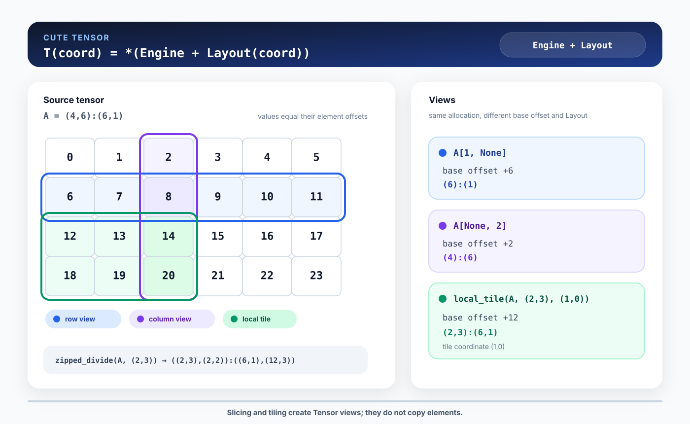

# 03. Tensor, slicing, and tiling

`Layout`만으로는 실제 값을 읽을 수 없습니다. Layout은 coordinate-to-offset mapping일 뿐이고, 그 offset을 적용할 memory가 필요합니다. CuTe의 `Tensor`는 이 두 요소를 결합합니다.

```text
Tensor = Engine + Layout

T(coord) = *(Engine + Layout(coord))
```

`Engine`은 data에 접근하는 iterator입니다. 대부분의 global-memory Tensor에서는 typed pointer로 생각해도 충분합니다. `Layout`은 coordinate를 element offset으로 바꿉니다. Tensor는 그만큼 iterator를 이동해 값을 읽거나 씁니다.



*Figure 3-1. Slicing과 tiling은 allocation을 복사하지 않고 base offset과 Layout이 다른 Tensor view를 만든다.*

## PyTorch tensor를 CuTe Tensor로 바꾸기

다음 PyTorch tensor는 4×6 row-major matrix입니다.

```python
torch_tensor = torch.arange(
    24,
    device="cuda",
    dtype=torch.float32,
).reshape(4, 6)
```

`from_dlpack()`으로 같은 CUDA allocation을 가리키는 CuTe Tensor를 만듭니다.

```python
from cutlass.cute.runtime import from_dlpack

a = from_dlpack(torch_tensor, assumed_align=16)
print(a.layout)  # (4,6):(6,1)
```

DLPack conversion은 element를 복사하지 않습니다. PyTorch tensor가 allocation의 lifetime을 관리하고 CuTe Tensor는 그 memory를 참조합니다. Kernel이 `a`에 store하면 같은 위치를 보는 `torch_tensor`에서도 결과가 바뀝니다.

`assumed_align=16`은 pointer가 16-byte aligned라고 compiler에 알려 주는 조건입니다. Pointer를 새로 정렬하지 않으므로 실제 address가 이 조건을 만족할 때만 지정해야 합니다.

CuTe가 Tensor를 출력할 때는 pointer 정보 뒤에 Layout이 붙습니다.

```text
tensor(gmem pointer ... o (4,6):(6,1))
```

Pointer address는 실행할 때마다 달라질 수 있지만 `(4,6):(6,1)`은 이 예제의 coordinate mapping을 나타냅니다.

## Coordinate로 element 읽기

GPU kernel 안에서 Tensor를 indexing하면 먼저 Layout을 계산한 뒤 해당 offset의 element를 읽습니다.

```python
value = a[(2, 3)]
```

Layout이 `(4,6):(6,1)`이므로 coordinate `(2, 3)`의 offset은 다음과 같습니다.

```text
Layout(2, 3) = 2 × 6 + 3 × 1 = 15
a[(2, 3)]    = *(pointer + 15)
```

이 예제의 값은 offset과 같게 초기화했으므로 결과는 `15.0`입니다.

## `None`으로 mode 남기기

모든 mode에 정수 coordinate를 주면 element 하나를 얻습니다. 일부 mode에 `None`을 주면 그 mode 전체를 남긴 Tensor view가 만들어집니다.

```python
row = a[(1, None)]
column = a[(None, 2)]
```

Row view를 먼저 계산해 보겠습니다.

```text
A             (4,6):(6,1), base offset +0
A[1, None]      (6):(1),   base offset +6
```

첫 번째 mode를 coordinate 1로 고정하면 base pointer가 `1 × 6`만큼 이동합니다. 두 번째 mode는 `None`이므로 Shape 6과 Stride 1이 남습니다. 따라서 이 view는 값 `[6, 7, 8, 9, 10, 11]`을 봅니다.

Column view는 두 번째 mode를 coordinate 2로 고정합니다.

```text
A              (4,6):(6,1), base offset +0
A[None, 2]       (4):(6),   base offset +2
```

Base pointer는 `2 × 1`만큼 이동하고 첫 번째 mode의 Stride 6이 남습니다. 값은 `[2, 8, 14, 20]`입니다. 연속된 row와 달리 column의 element는 memory에서 6칸씩 떨어져 있습니다.

Slicing은 다음 두 작업을 함께 수행합니다.

1. 고정한 coordinate의 offset을 기존 iterator에 더합니다.
2. `None`으로 남긴 mode만 모아 새 Layout을 만듭니다.

Element를 옮기거나 새 CUDA allocation을 만들지 않습니다.

## Tensor를 tile로 나누기

GPU kernel은 matrix 전체보다 일정한 크기의 tile을 반복 처리합니다. `cute.zipped_divide()`는 Tensor의 각 mode를 tile 내부 좌표와 tile 번호로 나눕니다.

```python
tiled = cute.zipped_divide(a, (2, 3))
print(tiled.layout)
```

4×6 Tensor를 2×3 tile로 나눈 결과는 다음과 같습니다.

```text
A              (4,6):(6,1)
zipped_divide  ((2,3),(2,2)):((6,1),(12,3))
```

결과의 첫 번째 top-level mode `(2,3)`은 tile 안의 row와 column입니다. 두 번째 top-level mode `(2,2)`는 원본 Tensor에 2×2개의 tile이 있다는 뜻입니다.

Stride도 같은 두 묶음으로 읽습니다.

| Coordinate | Shape | Stride | Meaning |
|---|---|---|---|
| tile 내부 `(i, j)` | `(2, 3)` | `(6, 1)` | 같은 tile 안에서 원본 row-major mapping을 유지 |
| tile 번호 `(tm, tn)` | `(2, 2)` | `(12, 3)` | 다음 tile row는 12칸, 다음 tile column은 3칸 이동 |

`zipped_divide()`는 memory를 바꾸지 않습니다. 같은 iterator에 더 계층적인 Layout을 붙여 coordinate를 두 단계로 표현합니다.

## `local_tile()`로 tile 하나 선택하기

`cute.local_tile()`은 `zipped_divide()`와 slicing을 묶은 함수입니다. Tiler를 적용한 뒤 tile 번호를 하나 선택합니다.

```python
tile = cute.local_tile(a, (2, 3), (1, 0))
print(tile.layout)  # (2,3):(6,1)
```

Tile coordinate `(1, 0)`은 두 번째 tile row, 첫 번째 tile column을 뜻합니다. 시작 coordinate는 원본 Tensor의 `(2, 0)`이고 base offset은 `2 × 6 = 12`입니다.

```text
12 13 14
18 19 20
```

결과 Layout `(2,3):(6,1)`에서 row 사이의 Stride 6이 유지되는 점이 중요합니다. Tile의 Shape이 2×3이라고 해서 memory에 여섯 값이 연속으로 모여 있는 것은 아닙니다. 원본 Tensor의 Layout을 따라 두 row 사이에 세 element가 남아 있습니다.

실제 kernel에서는 tile coordinate에 `blockIdx`를 넣는 경우가 많습니다.

```python
bid_x, bid_y, _ = cute.arch.block_idx()
cta_tile = cute.local_tile(a, (tile_m, tile_n), (bid_x, bid_y))
```

이렇게 만든 `cta_tile`을 다시 thread별로 partition하는 과정은 Part 2에서 다룹니다.

## Shape이 tile 크기로 나누어떨어지지 않을 때

`zipped_divide()`의 tile 개수는 각 mode에 `ceil_div`를 적용해 계산합니다. 예를 들어 5×7 Tensor를 2×3 tile로 나누면 tile grid는 3×3입니다. 마지막 tile에는 원본 Shape 밖의 coordinate가 포함될 수 있습니다.

```text
ceil_div(5, 2) = 3
ceil_div(7, 3) = 3
```

Layout transform이 자동으로 load와 store를 막아 주지는 않습니다. Boundary tile에서는 원본 coordinate를 함께 계산해 predicate를 적용해야 합니다. Part 2의 copy kernel에서 이 조건을 실제 code로 구현합니다.

## Running the example

전체 코드는 [`examples/03_tensor/tensor_views.py`](../examples/03_tensor/tensor_views.py)에 있습니다.

```bash
python examples/03_tensor/tensor_views.py
```

Compile 과정에서 확인한 Layout은 다음과 같습니다.

```text
A layout:      (4,6):(6,1)
row layout:    (6):(1)
column layout: (4):(6)
tiled layout:  ((2,3),(2,2)):((6,1),(12,3))
tile layout:   (2,3):(6,1)
```

GPU에서는 `cute.print_tensor()`가 각 view의 실제 값을 출력합니다.

```text
row:    [6, 7, 8, 9, 10, 11]
column: [2, 8, 14, 20]
tile:   [[12, 13, 14],
         [18, 19, 20]]
```

## Summary

- `Tensor`는 data에 접근하는 `Engine`과 coordinate mapping을 나타내는 `Layout`으로 구성됩니다.
- `from_dlpack()`은 PyTorch tensor와 CUDA allocation을 공유합니다.
- Integer coordinate는 mode를 고정하고 `None`은 해당 mode를 view에 남깁니다.
- Slicing은 base offset과 Layout을 바꾸며 element를 복사하지 않습니다.
- `zipped_divide()`는 coordinate를 tile 내부와 tile 번호로 나눕니다.
- `local_tile()`은 tiling한 Tensor에서 tile 하나를 선택합니다.

Part 1에서는 coordinate가 storage에 연결되고 Tensor view가 만들어지는 과정까지 확인했습니다. Part 2에서는 이 Tensor를 사용해 scalar vector addition을 vectorized kernel로 확장합니다.

## References

1. [NVIDIA, “CuTe Tensors,” CUTLASS Documentation](https://docs.nvidia.com/cutlass/latest/media/docs/cpp/cute/03_tensor.html)
2. [NVIDIA, “CuTe DSL Core API,” CUTLASS Documentation](https://docs.nvidia.com/cutlass/latest/media/docs/pythonDSL/cute_dsl_api/cute.html)
3. [NVIDIA, “CuTe Algorithms,” CUTLASS Documentation](https://docs.nvidia.com/cutlass/latest/media/docs/cpp/cute/04_algorithms.html)
4. [NVIDIA, “Educational Notebooks,” CUTLASS Documentation](https://docs.nvidia.com/cutlass/latest/media/docs/pythonDSL/guides/notebooks.html)
5. [Simon Veitner, “CuTe partitions”](https://veitner.bearblog.dev/cute-partitions/)
