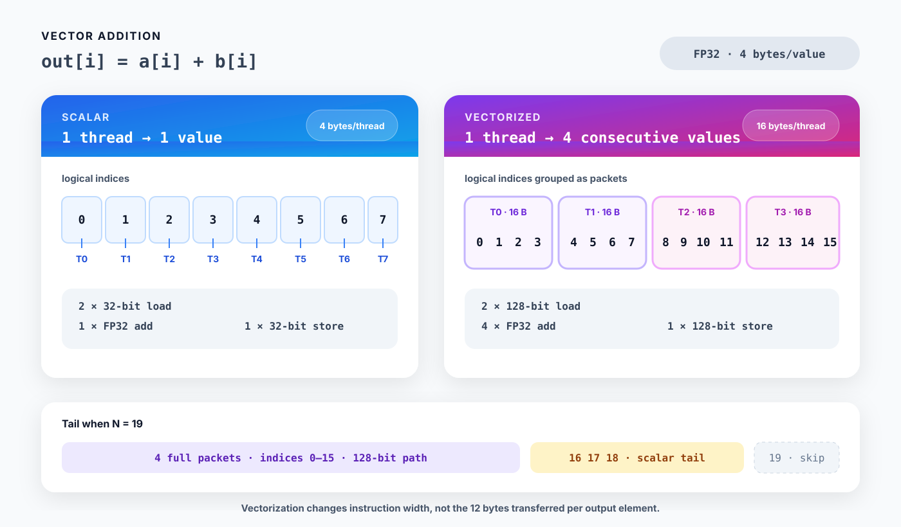

# 04. Vector addition: scalar and vectorized kernels

Part 1에서는 `Layout`과 `Tensor`가 coordinate를 memory address로 바꾸는 과정을 살펴봤습니다. 이제 같은 연산을 두 가지 방식으로 구현하면서 CuTe DSL kernel의 기본 구조를 익힙니다.

```text
out[i] = a[i] + b[i]
```

첫 번째 kernel은 thread마다 FP32 값 하나를 처리합니다. 두 번째 kernel은 thread마다 연속된 FP32 값 네 개를 16-byte packet으로 처리합니다. 연산은 같지만 thread와 data의 mapping, memory instruction의 폭이 달라집니다.



*Figure 4-1. Scalar kernel은 thread마다 FP32 값 하나를 처리하고, vectorized kernel은 연속된 네 값을 하나의 16-byte packet으로 처리한다.*

전체 코드는 [`examples/04_vector_add/vector_add.py`](../examples/04_vector_add/vector_add.py)에 있습니다.

## 1. 연산량과 memory traffic

FP32 output 하나를 계산하려면 `a`와 `b`에서 각각 4 bytes를 읽고 `out`에 4 bytes를 씁니다.

| Output element 하나당 작업 | 수치 |
|---|---:|
| FP32 addition | 1 FLOP |
| Global memory read | 8 bytes |
| Global memory write | 4 bytes |
| Arithmetic intensity | 약 0.083 FLOP/byte |

Cache 효과를 제외하면 arithmetic intensity는 `1 / 12 FLOP/byte`입니다. 따라서 충분히 큰 vector addition은 보통 memory bandwidth의 영향을 크게 받습니다. Vectorization은 이 12 bytes를 줄이지 않습니다. 같은 양의 data를 더 넓은 memory instruction으로 처리합니다.

## 2. Scalar kernel

먼저 thread 하나가 element 하나를 처리하는 CUDA의 기본 mapping을 그대로 작성합니다.

```python
THREADS = 256


@cute.kernel
def scalar_vector_add_kernel(
    a: cute.Tensor,
    b: cute.Tensor,
    out: cute.Tensor,
):
    tid, _, _ = cute.arch.thread_idx()
    bid, _, _ = cute.arch.block_idx()
    i = bid * THREADS + tid

    if i < cute.size(out):
        out[i] = a[i] + b[i]
```

`thread_idx()`와 `block_idx()`는 세 축의 index를 tuple로 반환합니다. 이 kernel은 x축만 사용합니다. Block `bid`의 thread `tid`가 담당하는 element는 다음과 같습니다.

```text
i = bid × 256 + tid
```

마지막 block은 256개보다 적은 element를 담당할 수 있으므로 `i < cute.size(out)`로 memory access를 보호합니다. 이 조건을 빼면 마지막 block의 일부 thread가 allocation 밖을 읽고 쓸 수 있습니다.

Launch configuration은 `@cute.jit` host function에서 계산합니다.

```python
@cute.jit
def scalar_vector_add(
    a: cute.Tensor,
    b: cute.Tensor,
    out: cute.Tensor,
):
    blocks = cute.ceil_div(cute.size(out), THREADS)
    scalar_vector_add_kernel(a, b, out).launch(
        grid=(blocks, 1, 1),
        block=(THREADS, 1, 1),
    )
```

`ceil_div(N, 256)`은 모든 element를 포함하는 최소 block 수를 구합니다. 예를 들어 `N = 4099`이면 17개 block을 launch하고, 마지막 block에서는 앞의 3개 thread만 유효한 값을 처리합니다.

## 3. 네 값을 하나의 packet으로 묶기

Vectorized kernel에서는 thread 하나가 연속된 FP32 값 네 개를 처리합니다.

```text
thread 0 → element 0, 1, 2, 3
thread 1 → element 4, 5, 6, 7
thread 2 → element 8, 9, 10, 11
```

FP32 네 개는 16 bytes입니다. Allocation의 시작 주소가 16-byte aligned이고 packet 시작 offset이 16 bytes의 배수라면 compiler는 128-bit load와 store를 생성할 수 있습니다.

PyTorch tensor를 CuTe Tensor로 변환할 때 이 alignment를 명시합니다.

```python
def as_cute_tensor(tensor: torch.Tensor) -> cute.Tensor:
    return from_dlpack(tensor, assumed_align=16).mark_layout_dynamic()
```

`assumed_align=16`은 pointer를 정렬해 주는 기능이 아닙니다. 입력 pointer가 실제로 16-byte aligned라는 사실을 compiler에 알려 주는 계약입니다. 계약과 다른 pointer를 넘기면 올바른 동작을 기대할 수 없습니다. PyTorch CUDA allocator가 반환한 일반적인 tensor는 이 예제의 정렬 조건을 만족하지만, 임의의 storage offset을 가진 view에는 같은 가정을 그대로 적용하면 안 됩니다.

## 4. `zipped_divide()`로 packet view 만들기

원래 1D Tensor의 Layout을 다음과 같이 놓겠습니다.

```text
(N):(1)
```

`zipped_divide()`는 coordinate를 packet 내부 위치와 packet 번호로 나눕니다.

```python
packets_a = cute.zipped_divide(a, (4,))
```

`N = 16`이면 Layout은 다음과 같이 해석할 수 있습니다.

```text
((4),(4)):((1),(4))
  │    │      │   └─ 다음 packet은 4 elements 뒤에서 시작
  │    │      └──── packet 내부에서는 1 element씩 이동
  │    └─────────── packet 수
  └──────────────── packet당 element 수
```

두 좌표를 `(lane, packet_idx)`라고 하면 원래 Tensor의 offset은 다음과 같습니다.

```text
offset = lane + 4 × packet_idx
```

Runtime에 `N`이 정해지는 예제에서는 packet 수가 dynamic이므로 Layout의 두 번째 크기가 `?`로 표시됩니다.

```text
((4),(?)):((1),(4))
```

Packet view는 `@cute.jit` function에서 한 번 만듭니다. Kernel은 변환된 Tensor를 인자로 받습니다.

```python
@cute.jit
def vectorized_vector_add(a, b, out):
    packets_a = cute.zipped_divide(a, (4,))
    packets_b = cute.zipped_divide(b, (4,))
    packets_out = cute.zipped_divide(out, (4,))
    size = cute.size(out)
    packets = cute.ceil_div(size, 4)
    blocks = cute.ceil_div(packets, THREADS)

    vectorized_vector_add_kernel(
        packets_a, packets_b, packets_out, size
    ).launch(
        grid=(blocks, 1, 1),
        block=(THREADS, 1, 1),
    )
```

Scalar kernel이 `ceil_div(N, 256)`개 block을 사용했다면 vectorized kernel은 `ceil_div(ceil_div(N, 4), 256)`개 block을 사용합니다.

## 5. Packet load와 store

Kernel에서 `None`으로 첫 번째 mode를 남기면 packet 하나를 나타내는 Tensor view를 얻습니다.

```python
packet_a = packets_a[(None, packet_idx)]
packet_b = packets_b[(None, packet_idx)]
packet_out = packets_out[(None, packet_idx)]
```

각 view의 logical shape는 `(4,)`이고 stride는 `(1,)`입니다. `load()`는 네 값을 register의 `TensorSSA`로 읽습니다. Addition은 네 element에 적용되고, `store()`가 결과를 memory에 씁니다.

```python
packet_out.store(packet_a.load() + packet_b.load())
```

CuTe DSL source만 보고 실제 instruction 폭을 단정해서는 안 됩니다. Target architecture, alignment, Layout, compiler version에 따라 lowering 결과가 달라질 수 있습니다. 이 예제의 생성 코드를 확인하는 방법은 뒤에서 다룹니다.

## 6. 길이가 4의 배수가 아닐 때

`N = 4099`라면 완전한 packet은 1024개이고 마지막 3개 element가 남습니다.

```text
full packets: [0, 4096)
tail:         [4096, 4099)
```

완전한 packet만 vectorized load와 store를 사용합니다. 마지막 packet을 담당하는 thread는 남은 element를 하나씩 검사합니다.

```python
full_packets = size // 4

if packet_idx < full_packets:
    packet_a = packets_a[(None, packet_idx)]
    packet_b = packets_b[(None, packet_idx)]
    packet_out = packets_out[(None, packet_idx)]
    packet_out.store(packet_a.load() + packet_b.load())
elif packet_idx == full_packets:
    for lane in cutlass.range_constexpr(4):
        i = packet_idx * 4 + lane
        if i < size:
            packets_out[(lane, packet_idx)] = (
                packets_a[(lane, packet_idx)]
                + packets_b[(lane, packet_idx)]
            )
```

`range_constexpr(4)`는 길이가 compile time에 정해진 loop를 만듭니다. `N`이 4의 배수이면 `packet_idx == full_packets`인 thread에서도 네 조건이 모두 거짓이므로 memory access가 발생하지 않습니다.

이 구조는 tail의 1~3개 element만 scalar instruction으로 처리합니다. 전체 Tensor를 padding하거나 마지막 16 bytes를 allocation 밖에서 읽지 않습니다.

## 7. 실행과 결과 확인

기본 입력 크기는 tail path까지 실행하도록 4099로 정했습니다.

```bash
source ~/workspace/.venv_wsl/bin/activate
python examples/04_vector_add/vector_add.py
```

다른 크기도 같은 코드로 확인할 수 있습니다.

```bash
for n in 1 3 4 5 4096 4099 1048579; do
  python examples/04_vector_add/vector_add.py --size "$n"
done
```

예제는 scalar와 vectorized output을 각각 PyTorch 결과와 비교합니다.

```python
reference = a + b
torch.testing.assert_close(scalar_out, reference, rtol=0, atol=0)
torch.testing.assert_close(vectorized_out, reference, rtol=0, atol=0)
```

FP32 addition의 operand 순서가 같으므로 이 예제에서는 tolerance 없이 exact comparison을 사용합니다.

## 8. PTX와 SASS 확인하기

CuTe DSL이 생성한 파일을 보존하려면 다음 환경 변수를 사용합니다.

```bash
mkdir -p build/04_vector_add
CUTE_DSL_KEEP=ptx,cubin,sass \
CUTE_DSL_DUMP_DIR=build/04_vector_add \
python examples/04_vector_add/vector_add.py --size 4096
```

생성된 `.ptx`와 `.sass`에서 scalar path와 vectorized path를 비교합니다. CuTe DSL 4.6.1과 `sm_120`에서 이 예제를 compile했을 때 full-packet path는 다음 instruction으로 lowering됐습니다.

| Path | PTX | SASS |
|---|---|---|
| Scalar load | scalar `ld.global` | `LDG.E` |
| Scalar store | scalar `st.global` | `STG.E` |
| Four-value load | `ld.global.v2.b64` | `LDG.E.128` |
| Four-value store | `st.global.v2.b64` | `STG.E.128` |
| Tail | scalar load/store | `LDG.E` / `STG.E` |

PTX의 `v2.b64`는 64-bit register 두 개, 즉 128 bits를 한 instruction에서 다룹니다. GPU에서 실제로 실행되는 instruction은 SASS의 `LDG.E.128`과 `STG.E.128`에서 확인할 수 있습니다. 다른 target이나 compiler version에서는 mnemonic과 code shape가 달라질 수 있으므로 자신의 환경에서 생성 결과를 다시 확인해야 합니다.

## 9. Vectorization이 바꾸는 것

두 kernel 모두 output element당 12 bytes의 global memory traffic과 FP32 addition 한 번을 수행합니다. Scalar kernel도 warp의 thread들이 연속된 주소에 접근하므로 access pattern 자체는 이미 coalesced입니다.

Vectorized kernel의 차이는 다음과 같습니다.

- thread 하나가 처리하는 값이 1개에서 4개로 늘어납니다.
- 같은 element 수에서 실행되는 thread와 warp 수가 약 4분의 1로 줄어듭니다.
- Full-packet path는 32-bit memory instruction 네 개 대신 128-bit instruction 하나를 사용할 수 있습니다.
- Address calculation과 instruction issue 수는 줄어들 수 있지만, 전체 memory traffic은 그대로입니다.
- Tail 처리와 alignment 계약이 추가됩니다.

따라서 vectorized version이 항상 더 빠르다고 결론 내릴 수는 없습니다. 입력 크기, launch overhead, memory bandwidth, compiler가 생성한 code를 함께 측정해야 합니다. 여기서 중요한 결과는 Python source의 의도가 실제 128-bit memory instruction으로 이어졌는지를 확인하는 것입니다.

## Summary

- Scalar kernel은 `i = blockIdx.x × blockDim.x + threadIdx.x`로 element 하나를 선택합니다.
- `zipped_divide(tensor, (4,))`는 1D Tensor를 packet 내부 위치와 packet 번호로 나눕니다.
- `tensor[(None, packet_idx)]`는 연속된 네 값을 가진 Tensor view를 만듭니다.
- 16-byte vectorized access에는 실제 pointer alignment와 연속된 Layout이 모두 필요합니다.
- 길이가 4의 배수가 아닐 때는 완전한 packet만 vectorized path로 처리하고 나머지는 predication을 적용합니다.
- Vectorization은 memory traffic의 양이 아니라 instruction 폭과 thread-to-data mapping을 바꿉니다.
- 생성된 PTX와 SASS를 확인해야 vectorized memory instruction이 실제로 사용됐는지 알 수 있습니다.

다음 장에서는 여러 thread가 만든 값을 하나로 합치는 reduction을 구현합니다. Warp shuffle에서 시작해 block 전체 reduction으로 확장하면서 thread partitioning과 synchronization을 다룹니다.

## References

1. [NVIDIA, “Educational Notebooks,” CUTLASS Documentation](https://docs.nvidia.com/cutlass/latest/media/docs/pythonDSL/guides/notebooks.html)
2. [NVIDIA, “CuTe DSL Core API,” CUTLASS Documentation](https://docs.nvidia.com/cutlass/latest/media/docs/pythonDSL/cute_dsl_api/cute.html)
3. [NVIDIA, “CUDA C++ Programming Guide,” Device Memory Accesses](https://docs.nvidia.com/cuda/cuda-c-programming-guide/)
4. [NVIDIA, “Debugging CuTe DSL,” CUTLASS Documentation](https://docs.nvidia.com/cutlass/latest/media/docs/pythonDSL/guides/debugging.html)
5. [Simon Veitner, “An applied introduction to CuTeDSL”](https://veitner.bearblog.dev/an-applied-introduction-to-cutedsl/)
