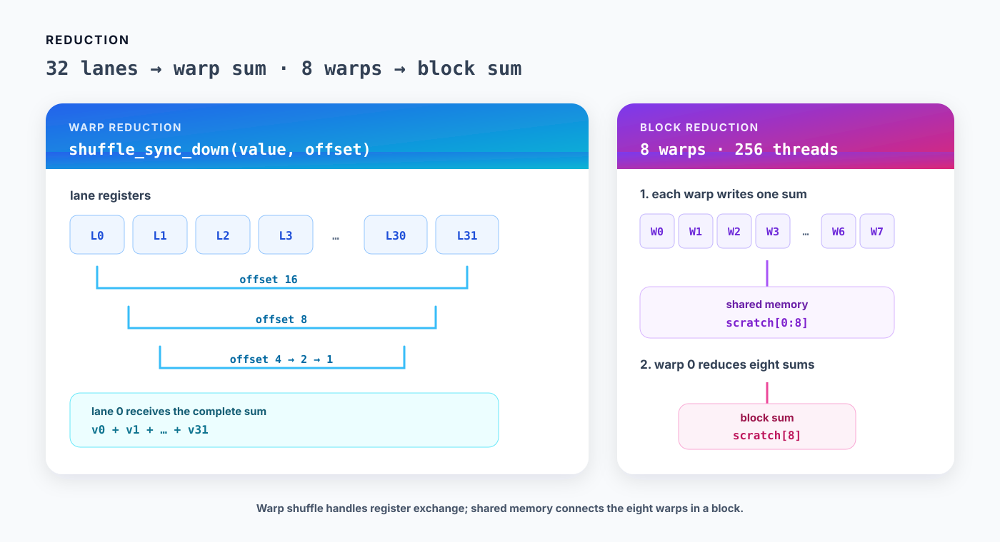

# 05. Warp and block reduction

Reduction은 여러 값을 하나로 합치는 연산입니다. 이 장에서는 FP32 배열을 더해 warp마다 합계를 만드는 kernel과 block마다 합계를 만드는 kernel을 차례로 작성합니다.



*Figure 5-1. Warp 안에서는 shuffle로 값을 합치고, block 전체의 합은 warp별 결과를 shared memory에 모은 뒤 다시 reduction한다.*

실행 가능한 전체 코드는 [`examples/05_reduction/reduction.py`](../examples/05_reduction/reduction.py)에 있습니다.

## 1. Warp reduction

Warp의 32개 thread는 `shuffle_sync_down()`으로 register 값을 직접 주고받을 수 있습니다. 아래 코드는 lane `0`에 32개 값의 합을 만듭니다.

```python
WARP_SIZE = 32


@cute.jit
def warp_reduce_sum(value: cute.Numeric) -> cute.Numeric:
    for step in range(5):
        offset = 1 << (4 - step)
        value += cute.arch.shuffle_sync_down(value, offset=offset)
    return value
```

각 단계에서 현재 lane은 `offset`만큼 뒤에 있는 lane의 값을 읽습니다.

| `offset` | lane 0의 값에 포함되는 원소 수 |
|---:|---:|
| 16 | 2 |
| 8 | 4 |
| 4 | 8 |
| 2 | 16 |
| 1 | 32 |

마지막에는 lane `0`만 완전한 합을 가집니다. 다른 lane의 반환값은 이 kernel에서 사용하지 않습니다.

입력 크기가 32의 배수가 아니어도 모든 thread를 shuffle에 참여시킵니다. 배열 범위를 벗어난 thread가 `0.0`을 넣도록 하면 마지막 warp도 같은 reduction 코드를 실행할 수 있습니다.

```python
@cute.kernel
def warp_reduction_kernel(
    x: cute.Tensor,
    warp_sums: cute.Tensor,
):
    tid, _, _ = cute.arch.thread_idx()
    bid, _, _ = cute.arch.block_idx()
    i = bid * THREADS + tid

    value = cutlass.Float32(0.0)
    if i < cute.size(x):
        value = x[i]
    value = warp_reduce_sum(value)

    lane = tid & (WARP_SIZE - 1)
    warp = tid // WARP_SIZE
    if lane == 0:
        warp_sums[bid * WARPS_PER_BLOCK + warp] = value
```

`tid & 31`은 warp 안의 lane ID를, `tid // 32`는 block 안의 warp ID를 구합니다. 256-thread block에는 warp가 8개 있으므로 block마다 합계도 8개 나옵니다.

```python
@cute.jit
def launch_warp_reduction(
    x: cute.Tensor,
    warp_sums: cute.Tensor,
):
    # Split N values into blocks of 256; each block produces eight warp sums.
    blocks = cute.ceil_div(cute.size(x), THREADS)
    warp_reduction_kernel(x, warp_sums).launch(
        grid=(blocks, 1, 1),  # x: groups of 256 input values
        block=(THREADS, 1, 1),  # x: 256 threads, one value per thread
    )
```

입력이 `N`개일 때 launch와 출력 크기는 다음과 같습니다.

```text
grid.x          = ceil_div(N, 256)
block.x         = 256
warp_sums.size  = grid.x × 8
```

## 2. Block reduction

Warp 사이에는 shuffle을 직접 사용할 수 없습니다. 먼저 각 warp의 lane `0`이 shared memory에 부분합을 쓰고, 첫 번째 warp가 그 8개 값을 다시 더합니다.

```python
THREADS = 256
WARPS_PER_BLOCK = THREADS // WARP_SIZE


@cute.jit
def block_reduce_sum(
    value: cute.Numeric,
    scratch: cute.Tensor,
    tid: cutlass.Int32,
) -> cute.Numeric:
    lane = tid & (WARP_SIZE - 1)
    warp = tid // WARP_SIZE
    value = warp_reduce_sum(value)

    if lane == 0:
        scratch[warp] = value
    cute.arch.sync_threads()

    if warp == 0:
        value = cutlass.Float32(0.0)
        if lane < WARPS_PER_BLOCK:
            value = scratch[lane]
        value = warp_reduce_sum(value)
        if lane == 0:
            scratch[WARPS_PER_BLOCK] = value
    cute.arch.sync_threads()
    return scratch[WARPS_PER_BLOCK]
```

`scratch`의 앞 8칸에는 warp별 합계를 저장하고, 마지막 한 칸에는 block 합계를 저장합니다.

```text
scratch[0:8]  = eight warp sums
scratch[8]    = one block sum
```

첫 번째 `sync_threads()`는 모든 warp가 부분합을 쓰기 전에 첫 번째 warp가 읽는 일을 막습니다. 두 번째 barrier는 lane `0`이 최종 합을 쓰기 전에 다른 thread가 `scratch[8]`을 읽는 일을 막습니다.

Shared memory는 `SmemAllocator`로 할당합니다.

```python
@cute.kernel
def block_reduction_kernel(
    x: cute.Tensor,
    block_sums: cute.Tensor,
):
    tid, _, _ = cute.arch.thread_idx()
    bid, _, _ = cute.arch.block_idx()
    i = bid * THREADS + tid

    value = cutlass.Float32(0.0)
    if i < cute.size(x):
        value = x[i]

    smem = cutlass.utils.SmemAllocator()
    scratch = smem.allocate_tensor(cutlass.Float32, WARPS_PER_BLOCK + 1)
    value = block_reduce_sum(value, scratch, tid)

    if tid == 0:
        block_sums[bid] = value
```

Block마다 최종 합 하나를 쓰므로 출력 크기는 `ceil_div(N, 256)`입니다.

```python
@cute.jit
def launch_block_reduction(
    x: cute.Tensor,
    block_sums: cute.Tensor,
):
    # Split N values into blocks of 256; each block produces one sum.
    blocks = cute.ceil_div(cute.size(x), THREADS)
    block_reduction_kernel(x, block_sums).launch(
        grid=(blocks, 1, 1),  # x: one output sum per 256 input values
        block=(THREADS, 1, 1),  # x: 256 threads cooperate on one sum
    )
```

이 kernel은 배열 전체를 scalar 하나로 줄이지 않습니다. 각 block이 담당한 최대 256개 값의 합을 출력합니다. 전체 합이 필요하다면 block 결과를 다시 reduction하거나, 다음 연산이 block별 부분합을 직접 소비하도록 구성할 수 있습니다.

## 3. 실행하고 확인하기

```bash
source ~/workspace/.venv_wsl/bin/activate
python examples/05_reduction/reduction.py --size 4099
```

```text
PASS: 4099 values, 17 blocks
```

`4099`개 값은 256개씩 `17`개 block으로 나뉩니다. 출력은 warp 합계 `17 × 8 = 136`개와 block 합계 `17`개입니다. 예제는 부족한 마지막 block을 0으로 채운 PyTorch 결과와 두 출력을 비교합니다.

Floating-point 덧셈은 결합법칙이 성립하지 않으므로 순차적인 합과 reduction tree의 결과가 bitwise identical하다고 가정할 수 없습니다. 예제는 FP32에 맞는 tolerance로 정확성을 검사합니다.

## Summary

- Warp 안에서는 shuffle로 register 값을 모을 수 있습니다.
- Block reduction은 warp별 합계를 shared memory에 모아 한 번 더 reduction합니다.
- Barrier 앞뒤의 모든 thread는 같은 control flow로 도달해야 합니다.
- 범위를 벗어난 thread에 덧셈의 항등원인 `0.0`을 넣으면 tail도 같은 경로로 처리할 수 있습니다.

다음 장에서는 shared memory로 global memory 접근 순서를 바꾸어 행렬을 transpose합니다.

## References

1. [NVIDIA, “CUDA C++ Programming Guide,” SIMT Architecture and Warp Shuffle Functions](https://docs.nvidia.com/cuda/cuda-c-programming-guide/)
2. [NVIDIA, `reduction` CUDA Sample](https://github.com/NVIDIA/cuda-samples/tree/master/Samples/2_Concepts_and_Techniques/reduction)
3. [NVIDIA, `cta_norm.py`, CUTLASS CuTe DSL Examples](https://github.com/NVIDIA/cutlass/blob/4ca61d0662bbc835c98dccfca022c8265edd9022/examples/python/CuTeDSL/hopper/cta_norm.py)
4. [NVIDIA, `SmemAllocator`, CUTLASS source](https://github.com/NVIDIA/cutlass/blob/4ca61d0662bbc835c98dccfca022c8265edd9022/python/CuTeDSL/cutlass/utils/smem_allocator.py)
