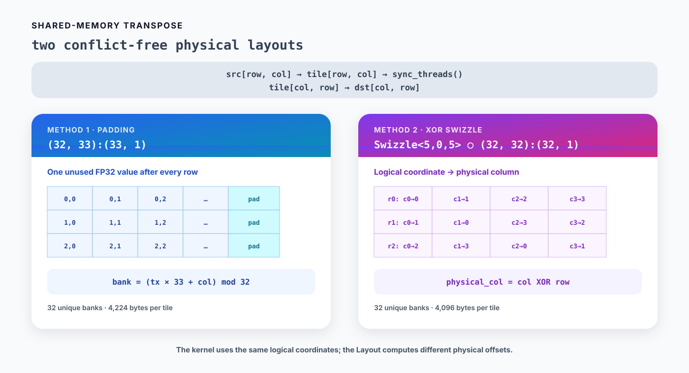

# 06. Shared-memory transpose and swizzle

행렬 transpose는 입력 `src[M, N]`을 출력 `dst[N, M]`으로 바꿉니다.

```text
dst[col, row] = src[row, col]
```

Global memory의 load와 store를 모두 연속 접근으로 만들려면 32×32 tile을 shared memory에 저장한 뒤 coordinate를 바꾸어 읽습니다. 이때 단순한 row-major shared-memory Layout은 bank conflict를 일으킵니다. 이 장에서는 padding과 XOR swizzle로 conflict를 제거하는 두 방법을 구현합니다.



*Figure 6-1. Padding은 row stride를 33으로 바꾸고, swizzle은 physical column을 XOR로 재배치한다.*

실행 가능한 전체 코드는 [`examples/06_transpose/transpose.py`](../examples/06_transpose/transpose.py)에 있습니다.

## 1. Grid와 block 정하기

입력의 row 수를 `M`, column 수를 `N`이라고 하겠습니다. Grid의 x축은 column 방향 tile을, y축은 row 방향 tile을 선택합니다.

```python
TILE_DIM = 32
BLOCK_ROWS = 8


@cute.jit
def padding_transpose(
    src: cute.Tensor,
    dst: cute.Tensor,
):
    # Split an MxN matrix into 32x32 tiles along columns and rows.
    tile_cols = cute.ceil_div(cute.size(src, mode=[1]), TILE_DIM)
    tile_rows = cute.ceil_div(cute.size(src, mode=[0]), TILE_DIM)
    padding_transpose_kernel(src, dst).launch(
        grid=(tile_cols, tile_rows, 1),  # x: ceil_div(N, 32), y: ceil_div(M, 32)
        block=(TILE_DIM, BLOCK_ROWS, 1),  # 32x8 threads; four values each
    )
```

Padding과 swizzle kernel은 같은 launch configuration을 사용합니다.

```text
grid.x  = ceil_div(N, 32)  # input column tiles
grid.y  = ceil_div(M, 32)  # input row tiles
block.x = 32               # one thread per tile column
block.y = 8                # eight active tile rows at a time
```

Block에는 `32 × 8 = 256`개 thread가 있습니다. 한 번에 8개 row를 처리하고 같은 thread가 row 방향으로 8씩 이동하므로, 각 thread는 최대 4개 값을 옮깁니다.

```text
threadIdx.y + row_offset = ty + {0, 8, 16, 24}
```

## 2. 단순한 32×32 Layout의 bank conflict

FP32 값 하나는 4 bytes이고 shared memory에는 32개 bank가 있습니다. 연속된 FP32 word는 연속된 bank에 놓이므로 bank 번호는 다음과 같이 계산할 수 있습니다.

```text
bank = word_offset mod 32
```

단순한 row-major tile의 Layout은 `(32, 32):(32, 1)`입니다.

```text
offset(row, col) = row × 32 + col
```

Warp가 row 하나를 shared memory에 쓸 때는 `row`가 같고 `col=0..31`이므로 32개 bank를 한 번씩 사용합니다. 문제는 transpose된 coordinate를 읽을 때 생깁니다. `tile[(tx, ty + row_offset)]`에서 warp의 `tx`는 `0..31`이고 두 번째 coordinate는 고정되어 있습니다.

```text
bank(tx, fixed_col)
    = (tx × 32 + fixed_col) mod 32
    = fixed_col
```

32개 thread가 서로 다른 주소를 읽지만 같은 bank에 접근하므로 32-way bank conflict가 발생합니다.

## 3. Padding: row stride를 33으로 바꾸기

첫 번째 방법은 각 row 뒤에 사용하지 않는 FP32 값 하나를 두는 것입니다.

```python
smem = cutlass.utils.SmemAllocator()
tile = smem.allocate_tensor(
    cutlass.Float32,
    cute.make_layout((TILE_DIM, TILE_DIM + 1), stride=(TILE_DIM + 1, 1)),
    byte_alignment=16,
)
```

```text
shape  = (32, 33)
stride = (33, 1)
offset(row, col) = row × 33 + col
```

실제 데이터는 각 row의 앞 32칸만 사용합니다. Transpose read의 bank 번호는 다음과 같이 바뀝니다.

```text
bank(tx, fixed_col)
    = (tx × 33 + fixed_col) mod 32
    = (tx + fixed_col) mod 32
```

`tx=0..31`이 서로 다른 bank를 선택하므로 conflict가 사라집니다. 코드는 단순하지만 shared memory에 FP32 32개가 추가됩니다.

```text
32 × 33 × 4 bytes = 4,224 bytes
```

## 4. Swizzle: physical column을 재배치하기

Swizzle은 logical shape를 32×32로 유지하면서 coordinate가 가리키는 physical offset을 바꿉니다. 먼저 일반 row-major Layout을 만들고 `Swizzle<5,0,5>`를 compose합니다.

```python
base_layout = cute.make_layout(
    (TILE_DIM, TILE_DIM),
    stride=(TILE_DIM, 1),
)
swizzled_layout = cute.make_composed_layout(
    cute.make_swizzle(5, 0, 5),
    0,
    base_layout,
)

smem = cutlass.utils.SmemAllocator()
tile = smem.allocate_tensor(
    cutlass.Float32,
    swizzled_layout,
    byte_alignment=16,
)
```

`make_composed_layout()`은 먼저 `base_layout(row, col)`로 linear offset을 계산하고 그 결과에 swizzle을 적용합니다. `(32, 32):(32, 1)`에서는 offset의 하위 5 bits가 `col`, 그 위의 5 bits가 `row`입니다.

```text
logical offset  = row × 32 + col
physical column = col XOR row
physical offset = row × 32 + (col XOR row)

offset bits     = [ row: bits 9..5 ][ col: bits 4..0 ]
swizzled bits   = [ row: bits 9..5 ][ col XOR row     ]
```

`cute.make_swizzle(5, 0, 5)`의 세 인자는 다음 뜻입니다.

| 인자 | 값 | 이 Layout에서 하는 일 |
|---|---:|---|
| `BBits` | 5 | Target과 source에서 각각 5 bits를 선택합니다. |
| `MBase` | 0 | 그대로 유지할 하위 bit가 없으므로 bits `0..4`가 target입니다. |
| `SShift` | 5 | Source인 row bits `5..9`를 target에 XOR합니다. |

Row 방향 write에서는 `col=tx`에 고정된 `row`를 XOR합니다. XOR은 `0..31`의 순열을 만들기 때문에 32개 bank가 그대로 한 번씩 선택됩니다.

Transpose read에서는 `row=tx`, `col=fixed_col`입니다.

```text
bank(tx, fixed_col) = fixed_col XOR tx
```

이 경우에도 `tx=0..31`이 서로 다른 bank를 선택합니다. Padding column이 없으므로 필요한 shared memory는 정확히 32×32 FP32 값입니다.

```text
32 × 32 × 4 bytes = 4,096 bytes
```

Kernel에서는 여전히 `tile[(row, col)]`과 `tile[(col, row)]`을 사용합니다. Logical coordinate를 physical address로 바꾸는 일은 `swizzled_layout`이 맡습니다. 이후 GEMM에서 복잡한 shared-memory Layout을 다룰 때도 같은 방식으로 coordinate mapping과 storage mapping을 분리합니다.

`Swizzle<5,0,5>`는 이 32×32 FP32 scalar access에 맞춘 값입니다. Dtype, vector width, tile shape, copy instruction이 바뀌면 swizzle parameters도 다시 정해야 합니다. Hopper와 Blackwell의 TMA swizzle도 지원하는 pattern과 alignment 조건을 따로 확인해야 합니다.

## 5. 공통 transpose dataflow

두 kernel은 shared-memory Layout만 다르고 data movement는 같습니다. 예제에서는 공통 부분을 `@cute.jit` function으로 분리합니다.

```python
@cute.jit
def copy_transposed_tile(
    src: cute.Tensor,
    dst: cute.Tensor,
    tile: cute.Tensor,
):
    tx, ty, _ = cute.arch.thread_idx()
    tile_x, tile_y, _ = cute.arch.block_idx()
    rows = cute.size(src, mode=[0])
    cols = cute.size(src, mode=[1])

    for row_offset in cutlass.range_constexpr(0, TILE_DIM, BLOCK_ROWS):
        row = tile_y * TILE_DIM + ty + row_offset
        col = tile_x * TILE_DIM + tx
        if row < rows and col < cols:
            tile[(ty + row_offset, tx)] = src[(row, col)]

    cute.arch.sync_threads()

    for row_offset in cutlass.range_constexpr(0, TILE_DIM, BLOCK_ROWS):
        out_row = tile_x * TILE_DIM + ty + row_offset
        out_col = tile_y * TILE_DIM + tx
        if out_row < cols and out_col < rows:
            dst[(out_row, out_col)] = tile[(tx, ty + row_offset)]
```

Load 단계에서는 같은 `ty + row_offset`를 가진 32개 thread가 연속된 input column을 읽습니다.

```text
global load: src[tile_y × 32 + ty + row_offset,
                 tile_x × 32 + tx]
shared write: tile[ty + row_offset, tx]
```

`sync_threads()` 뒤에는 shared-memory coordinate의 row와 column을 바꾸어 읽습니다.

```text
shared read:  tile[tx, ty + row_offset]
global store: dst[tile_x × 32 + ty + row_offset,
                  tile_y × 32 + tx]
```

`M`이나 `N`이 32의 배수가 아니면 가장자리 tile의 일부 coordinate가 행렬 밖을 가리킵니다. Load와 store를 각각 검사해야 하는 이유는 transpose 뒤에 row와 column의 범위도 서로 바뀌기 때문입니다.

## 6. Runtime Tensor Layout

PyTorch의 contiguous 2D tensor는 복사하지 않고 CuTe Tensor로 넘깁니다.

```python
def as_cute_tensor(tensor: torch.Tensor) -> cute.Tensor:
    return from_dlpack(tensor, assumed_align=16).mark_layout_dynamic(leading_dim=1)
```

`leading_dim=1`은 두 번째 mode의 stride가 `1`임을 compiler에 명시하고, shape와 나머지 stride를 runtime 값으로 둡니다. `M=1` 또는 `N=1`이라 여러 mode의 stride가 `1`로 보이는 경우에도 어느 mode가 contiguous인지 명확합니다.

## 7. 실행하고 확인하기

```bash
source ~/workspace/.venv_wsl/bin/activate
python examples/06_transpose/transpose.py --rows 1000 --cols 769
```

```text
PASS: padding and swizzle, (1000, 769) -> (769, 1000)
```

예제는 두 kernel을 모두 실행하고 각 결과를 `src.T`와 정확히 비교합니다. 이 장에서는 Layout과 정확성만 비교합니다. 어느 방식이 더 빠른지는 architecture, instruction, tile shape에 따라 달라지므로 별도의 benchmark 없이 결론을 내리지 않습니다.

## Summary

- 단순한 `(32, 32):(32, 1)` Layout은 transpose read에서 32-way bank conflict를 만듭니다.
- Padding은 row stride를 33으로 바꾸며 block당 shared memory를 128 bytes 더 사용합니다.
- XOR swizzle은 32×32 storage를 유지하면서 physical column을 재배치합니다.
- `make_composed_layout()`을 사용하면 kernel은 logical coordinate를 그대로 쓰고 Layout이 physical offset을 계산합니다.
- Swizzle parameters는 dtype, access width, tile shape에 맞춰 정해야 합니다.
- 가장자리 tile은 padding과 swizzle 모두 load와 store에 predication이 필요합니다.

다음 장에서는 warp reduction과 block reduction을 사용해 row-wise softmax를 구현합니다.

## References

1. [NVIDIA, “An Efficient Matrix Transpose in CUDA C/C++”](https://developer.nvidia.com/blog/efficient-matrix-transpose-cuda-cc/)
2. [NVIDIA, “CUDA C++ Programming Guide,” Shared Memory](https://docs.nvidia.com/cuda/cuda-c-programming-guide/)
3. [NVIDIA, `Swizzle`, CUTLASS source](https://github.com/NVIDIA/cutlass/blob/4ca61d0662bbc835c98dccfca022c8265edd9022/include/cute/swizzle.hpp)
4. [NVIDIA, `make_swizzle()` and `make_composed_layout()`, CuTe DSL source](https://github.com/NVIDIA/cutlass/blob/4ca61d0662bbc835c98dccfca022c8265edd9022/python/CuTeDSL/cutlass/cute/core.py)
5. [NVIDIA, shared-memory swizzle in `tensorop_gemm.py`, CuTe DSL example](https://github.com/NVIDIA/cutlass/blob/4ca61d0662bbc835c98dccfca022c8265edd9022/examples/python/CuTeDSL/ampere/tensorop_gemm.py)
