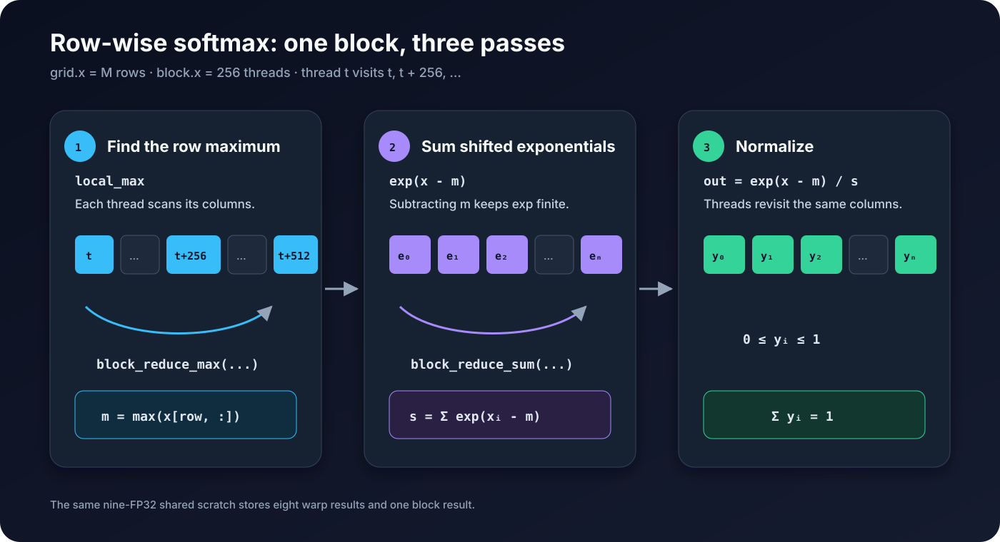

# 07. Row-wise softmax

Row-wise softmax는 각 row를 독립적인 확률 분포로 바꿉니다. 입력을 그대로 `exp()`에 넣으면 큰 값에서 overflow가 날 수 있으므로 row의 최댓값을 먼저 뺍니다.

```text
m = max(x[row, :])
s = Σ exp(x[row, col] - m)
out[row, col] = exp(x[row, col] - m) / s
```



*Figure 7-1. 한 block이 한 row를 맡아 최댓값, exponential 합계, normalization을 세 번의 pass로 계산한다.*

실행 가능한 전체 코드는 [`examples/07_softmax/softmax.py`](../examples/07_softmax/softmax.py)에 있습니다.

## 1. 한 block이 한 row를 처리하기

입력이 `M × N`이면 grid에 `M`개 block을 만들고 각 block이 row 하나를 맡습니다. 256개 thread는 column을 256 간격으로 나누어 처리합니다.

```python
THREADS = 256


@cute.jit
def row_softmax(
    x: cute.Tensor,
    out: cute.Tensor,
):
    # Launch one 256-thread block for each of the M rows.
    rows = cute.size(x, mode=[0])
    row_softmax_kernel(x, out).launch(
        grid=(rows, 1, 1),  # x: M row blocks; y and z are unused
        block=(THREADS, 1, 1),  # x: columns tid, tid+256, ...
    )
```

```text
grid.x  = M
block.x = 256
thread t handles columns t, t + 256, t + 512, ... < N
```

`N`은 runtime에 정해질 수 있으므로 반복에는 `cutlass.range()`를 사용합니다.

```python
for col in cutlass.range(tid, cols, THREADS, unroll=1):
    # col = tid, tid + 256, ...
```

`range_constexpr()`가 compile-time 상수 횟수를 펼치는 것과 달리, `cutlass.range()`는 runtime loop를 만듭니다. `unroll=1`은 반복을 강제로 여러 벌 복제하지 않습니다.

## 2. Max와 sum reduction

Chapter 05의 reduction 구조를 두 종류로 사용합니다. `sum`은 `0.0`에서 시작하고, `max`는 `-inf`에서 시작합니다.

```python
@cute.jit
def warp_reduce_sum(value: cute.Numeric) -> cute.Numeric:
    for step in range(5):
        offset = 1 << step
        value += cute.arch.shuffle_sync_bfly(value, offset=offset)
    return value


@cute.jit
def warp_reduce_max(value: cute.Numeric) -> cute.Numeric:
    for step in range(5):
        offset = 1 << step
        other = cute.arch.shuffle_sync_bfly(value, offset=offset)
        value = cute.arch.fmax(value, other)
    return value
```

`shuffle_sync_bfly()`는 XOR 관계에 있는 lane의 register를 읽습니다. `offset=1, 2, 4, 8, 16`을 거치면 warp의 모든 lane이 같은 reduction 결과를 갖습니다.

Block reduction은 warp별 결과 8개를 shared memory에 모은 뒤 첫 번째 warp가 다시 reduction합니다. Max version은 다음과 같습니다.

```python
@cute.jit
def block_reduce_max(
    value: cute.Numeric,
    scratch: cute.Tensor,
    tid: cutlass.Int32,
) -> cute.Numeric:
    lane = tid & (WARP_SIZE - 1)
    warp = tid // WARP_SIZE
    value = warp_reduce_max(value)
    if lane == 0:
        scratch[warp] = value
    cute.arch.sync_threads()

    if warp == 0:
        value = cutlass.Float32(-float("inf"))
        if lane < WARPS_PER_BLOCK:
            value = scratch[lane]
        value = warp_reduce_max(value)
        if lane == 0:
            scratch[WARPS_PER_BLOCK] = value
    cute.arch.sync_threads()
    return scratch[WARPS_PER_BLOCK]
```

`block_reduce_sum()`은 같은 구조에서 `warp_reduce_sum()`과 초깃값 `0.0`을 사용합니다. 두 함수가 shared scratch의 마지막 칸에 결과를 남기므로 9개의 FP32 값이면 충분합니다.

## 3. 세 번의 pass

Kernel은 row를 세 번 순회합니다.

```python
@cute.kernel
def row_softmax_kernel(
    x: cute.Tensor,
    out: cute.Tensor,
):
    tid, _, _ = cute.arch.thread_idx()
    row, _, _ = cute.arch.block_idx()
    cols = cute.size(x, mode=[1])

    smem = cutlass.utils.SmemAllocator()
    scratch = smem.allocate_tensor(cutlass.Float32, WARPS_PER_BLOCK + 1)

    local_max = cutlass.Float32(-float("inf"))
    for col in cutlass.range(tid, cols, THREADS, unroll=1):
        local_max = cute.arch.fmax(local_max, x[(row, col)])
    row_max = block_reduce_max(local_max, scratch, tid)

    local_sum = cutlass.Float32(0.0)
    for col in cutlass.range(tid, cols, THREADS, unroll=1):
        local_sum += cute.math.exp(x[(row, col)] - row_max)
    row_sum = block_reduce_sum(local_sum, scratch, tid)

    for col in cutlass.range(tid, cols, THREADS, unroll=1):
        out[(row, col)] = cute.math.exp(x[(row, col)] - row_max) / row_sum
```

첫 번째 pass는 thread별 `local_max`를 만들고 block 전체의 `row_max`로 줄입니다. 두 번째 pass는 `exp(x - row_max)`의 합을 계산합니다. 세 번째 pass는 같은 exponential을 다시 계산해 `row_sum`으로 나눕니다.

이 구현은 intermediate exponential을 global memory에 저장하지 않습니다. 대신 입력을 세 번 읽고 exponential을 두 번 계산합니다. 동작을 분명하게 보여 주는 첫 구현이며, register에 더 많은 값을 유지하거나 online softmax를 적용하는 최적화는 이후 attention kernel에서 다룹니다.

## 4. Runtime Tensor Layout

```python
def as_cute_tensor(tensor: torch.Tensor) -> cute.Tensor:
    return from_dlpack(tensor, assumed_align=16).mark_layout_dynamic(leading_dim=1)
```

입력은 PyTorch의 contiguous row-major tensor입니다. `leading_dim=1`은 두 번째 mode의 stride가 `1`임을 compiler에 명시하고, row와 column 크기 및 나머지 stride를 runtime 값으로 둡니다. 크기가 `1 × 1`일 때처럼 stride가 1인 mode를 자동으로 하나만 고르기 어려운 경우에도 Layout 조건이 명확합니다.

## 5. 실행하고 확인하기

```bash
source ~/workspace/.venv_wsl/bin/activate
python examples/07_softmax/softmax.py --rows 257 --cols 769
```

```text
PASS: 257 rows x 769 columns
```

예제는 결과를 `torch.softmax(x, dim=1)`과 비교하고, 각 row의 합이 1인지도 검사합니다. Reduction 순서와 `exp()` 구현이 PyTorch와 다를 수 있으므로 FP32 tolerance를 사용합니다.

이 kernel은 한 row를 한 block에서 처리할 수 있는 일반적인 출발점입니다. 실제 softmax와 attention kernel은 column 수, dtype, register 사용량, 다른 연산과의 fusion에 따라 thread 수와 dataflow를 별도로 선택합니다.

## Summary

- 안정적인 softmax는 row 최댓값을 뺀 뒤 exponential을 계산합니다.
- Grid의 block 하나가 row 하나를 담당하고, thread는 column을 block 크기 간격으로 순회합니다.
- Max와 sum은 같은 두 단계 reduction 구조를 서로 다른 초깃값과 연산으로 사용합니다.
- `cutlass.range()`는 반복 횟수가 runtime 값에 따라 달라질 때 사용합니다.
- 정확성 검사는 reference 값뿐 아니라 각 row의 합도 확인합니다.

Part 2에서는 elementwise, reduction, shared-memory tiling, runtime loop를 실제 kernel로 구현했습니다. Part 3에서는 이 구성 요소를 Tensor Core GEMM에 연결합니다.

## References

1. [NVIDIA, “CUDA C++ Programming Guide,” Warp Shuffle Functions and Shared Memory](https://docs.nvidia.com/cuda/cuda-c-programming-guide/)
2. [NVIDIA, “CuTe DSL Math API,” CUTLASS Documentation](https://docs.nvidia.com/cutlass/latest/media/docs/pythonDSL/cute_dsl_api/cute_math.html)
3. [NVIDIA, `cta_norm.py`, CUTLASS CuTe DSL Examples](https://github.com/NVIDIA/cutlass/blob/4ca61d0662bbc835c98dccfca022c8265edd9022/examples/python/CuTeDSL/hopper/cta_norm.py)
4. [Maxim Milakov and Natalia Gimelshein, “Online normalizer calculation for softmax”](https://arxiv.org/abs/1805.02867)
