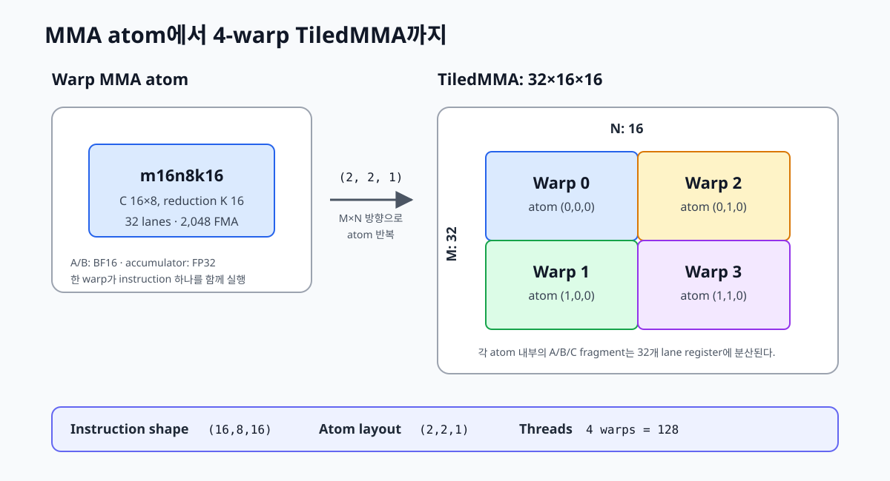

# 08. MMA atom and TiledMMA

앞 장까지는 thread가 scalar 연산을 실행했습니다. GEMM에서 다음 문장을 32개 lane이 각각 실행하면 warp instruction 하나가 32개의 FP32 FMA를 처리합니다.

```python
acc += a * b
```

Tensor Core의 `mma.sync`는 실행 단위와 operand 모양이 다릅니다. Warp 전체가 A, B, C fragment를 register에 나누어 들고 하나의 matrix multiply-accumulate instruction을 함께 실행합니다. CuTe는 이 hardware instruction을 `MMA operation`, lane과 value의 대응을 더한 객체를 `MMA atom`, CTA 안에서 atom을 반복한 객체를 `TiledMMA`로 표현합니다.



*Figure 8-1. `m16n8k16` MMA atom을 M 방향 두 개와 N 방향 두 개로 배치하면 네 warp가 참여하는 `32×16×16` TiledMMA가 된다.*

실행 가능한 전체 코드는 [`examples/08_mma_atom/mma_atom.py`](../examples/08_mma_atom/mma_atom.py)에 있습니다. 이 장에서는 kernel을 실행하기 전에 compile time 객체가 어떤 mapping을 만드는지 먼저 확인합니다.

## 1. `m16n8k16`이 계산하는 범위

이 장에서 사용할 instruction은 BF16 입력과 FP32 accumulator를 지원하는 `mma.sync.aligned.m16n8k16`입니다. Shape의 세 숫자는 M, N, K 순서입니다.

```text
A: 16×16
B: 16×8
C: 16×8
```

예제는 PyTorch `nn.Linear`와 같은 형태로 B를 `[N,K]`에 저장하고 `C = A @ B.T`를 계산합니다. 이 저장 형태에서는 같은 연산을 다음처럼 읽습니다.

```text
A[16,16] × B[8,16]ᵀ → C[16,8]
```

Instruction 하나가 갱신하는 C 원소는 `16×8=128`개입니다. 각 원소에 K 16개를 곱해 더하므로 연산량은 다음과 같습니다.

```text
16 × 8 × 16 = 2,048 FMA
2,048 × 2   = 4,096 FLOP
```

여기서 instruction 하나는 thread 하나가 실행하는 scalar FMA가 아닙니다. Warp의 32개 lane이 모두 참여하는 collective instruction입니다. 각 lane은 A/B operand와 C accumulator 중 일부만 register에 보관합니다.

`mma.sync`의 `sync`는 CTA 전체에 대한 `__syncthreads()`를 뜻하지 않습니다. Warp lane들이 같은 MMA instruction에 참여한다는 warp-level contract입니다. CTA의 다른 warp나 shared-memory copy 완료를 기다리려면 별도의 synchronization이 필요합니다.

## 2. MMA operation은 instruction 계약을 정한다

`MmaF16BF16Op`에는 input dtype, accumulator dtype, instruction shape를 전달합니다.

```python
op = cute.nvgpu.warp.MmaF16BF16Op(
    cutlass.BFloat16,
    cutlass.Float32,
    (16, 8, 16),
)
```

이 객체가 정하는 것은 다음 세 가지입니다.

- A와 B는 BF16입니다.
- C accumulator는 FP32입니다.
- Warp는 `m16n8k16` instruction을 사용합니다.

Operation 자체는 A/B 값을 load하지 않고 C를 저장하지도 않습니다. 어느 memory에서 operand를 가져올지, 어느 lane에 어떤 값을 배치할지는 이후의 Layout과 copy가 정합니다.

## 3. MMA atom은 lane과 matrix coordinate를 연결한다

`cute.make_mma_atom(op)`은 hardware operation에 thread-value Layout을 붙입니다. 예제에서는 `make_tiled_mma()`가 내부에서 atom을 만들기 때문에 별도 호출이 필요하지 않습니다.

```python
atom = cute.make_mma_atom(op)
tiled_mma = cute.make_tiled_mma(atom)
```

MMA atom에는 다음 mapping이 포함됩니다.

```text
(thread, value) → A의 (M, K)
(thread, value) → B의 (N, K)
(thread, value) → C의 (M, N)
```

`thread`는 warp lane이고 `value`는 그 lane이 보유하는 register fragment 안의 위치입니다. 따라서 C의 16×8을 lane마다 연속된 직사각형으로 잘라 주는 구조라고 가정하면 안 됩니다. `mma.sync`가 요구하는 register 순서에 맞춰 matrix coordinate가 lane들에 분산됩니다.

이 mapping이 필요한 이유는 instruction operand가 일반적인 2D array가 아니기 때문입니다. `mma.sync`는 각 lane의 정해진 register에서 A/B/C 값을 읽습니다. CuTe가 만드는 fragment Layout을 따르면 사용자가 PTX의 lane별 register 표를 직접 작성하지 않아도 됩니다.

## 4. TiledMMA는 atom을 CTA 안에 배치한다

Atom 하나는 warp 하나가 담당하는 `16×8×16`입니다. 다음 코드는 atom을 M 방향 두 번, N 방향 두 번 반복합니다.

```python
tiled_mma = cute.make_tiled_mma(
    op,
    atom_layout_mnk=(2, 2, 1),
)
```

각 mode의 의미는 다음과 같습니다.

| Mode | 반복 수 | 결과 |
|---|---:|---:|
| M | 2 | `2×16 = 32` rows |
| N | 2 | `2×8 = 16` columns |
| K | 1 | `1×16 = 16` reduction values |

따라서 TiledMMA의 논리 shape는 `32×16×16`이고 참여 thread는 `2×2×1×32=128`개입니다.

```text
MMA atom:  16×8×16, 1 warp
TiledMMA:  32×16×16, 4 warps
```

이 `32×16`은 이후 GEMM의 CTA tile 전체 크기가 아닙니다. Chapter 09에서는 CTA가 C의 64×64를 맡습니다. 한 CTA tile 안에서 `32×16` TiledMMA가 M과 N 방향으로 다시 반복됩니다.

## 5. `Thr Layout VMNK` 읽기

예제를 실행하면 다음 Layout이 출력됩니다.

```text
Thr Layout VMNK: (32,2,2,1):(1,32,64,0)
```

Shape `(32,2,2,1)`은 각각 lane, M atom, N atom, K atom의 개수입니다. Stride를 적용하면 CTA 내부 thread index는 다음처럼 계산됩니다.

```text
thread = lane + 32×atom_m + 64×atom_n
```

따라서 warp 배치는 다음과 같습니다.

| Atom coordinate `(m,n,k)` | Thread index | Warp |
|---|---:|---:|
| `(0,0,0)` | `lane + 0` | 0 |
| `(1,0,0)` | `lane + 32` | 1 |
| `(0,1,0)` | `lane + 64` | 2 |
| `(1,1,0)` | `lane + 96` | 3 |

K mode의 stride가 0인 이유는 `atom_layout_mnk[2]=1`이라 K 방향으로 별도 warp를 복제하지 않았기 때문입니다.

## 6. TiledMMA의 thread-value Layout

예제는 atom Layout뿐 아니라 tiled A/B/C Layout도 출력합니다.

```python
print(cute.pretty_str(tiled_mma.tv_layout_A_tiled))
print(cute.pretty_str(tiled_mma.tv_layout_B_tiled))
print(cute.pretty_str(tiled_mma.tv_layout_C_tiled))
```

출력되는 nested Layout 전체를 지금 외울 필요는 없습니다. 확인할 핵심은 두 가지입니다.

1. 첫 번째 묶음은 128 threads를 lane과 warp atom으로 나눕니다.
2. 두 번째 묶음은 각 thread가 보유할 A/B/C value와 matrix coordinate를 연결합니다.

Chapter 09의 다음 코드가 이 Layout을 실제 Tensor에 적용합니다.

```python
thr_mma = tiled_mma.get_slice(tid)
tCsA = thr_mma.partition_A(sA)
tCsB = thr_mma.partition_B(sB)
tCgC = thr_mma.partition_C(gC)
```

`get_slice(tid)`는 현재 thread의 lane/warp 위치를 선택합니다. `partition_A/B/C()`는 Tensor의 값을 옮기지 않고, 현재 thread가 볼 coordinate view를 만듭니다. 실제 data movement는 `cute.copy()`, 실제 matrix 연산은 `cute.gemm()`에서 발생합니다.

## 7. 예제 실행

```bash
source ~/workspace/.venv_wsl/bin/activate
python examples/08_mma_atom/mma_atom.py
```

출력의 핵심 부분은 다음과 같습니다.

```text
Instruction shape MNK = (16, 8, 16)
Thr Layout VMNK: (32,2,2,1):(1,32,64,0)
Shape MNK:       (16,8,16)

Tiled MMA shape
32 16 16
```

이 예제는 compile time 객체만 검사하므로 GPU kernel에서 matrix를 계산하지 않습니다. 다음 장에서 같은 `TiledMMA`를 shared-memory Tensor와 register fragment에 적용합니다.

## Summary

- `MmaF16BF16Op`은 dtype과 hardware instruction shape를 정합니다.
- `MMA atom`은 warp lane과 A/B/C register value를 matrix coordinate에 연결합니다.
- `TiledMMA`는 atom을 CTA의 M/N/K 방향으로 반복합니다.
- `(2,2,1)` atom Layout은 네 warp가 참여하는 `32×16×16` TiledMMA를 만듭니다.
- `partition_A/B/C()`는 thread별 view를 만들며 data를 이동하지 않습니다.
- `mma.sync`의 warp-level synchronization과 CTA barrier는 서로 다른 기능입니다.

## References

1. [NVIDIA, “Warp-level Matrix Multiply-Accumulate Programming”](https://docs.nvidia.com/cutlass/latest/media/docs/pythonDSL/mma_docs/wmma_programming.html)
2. [NVIDIA, “Parallel Thread Execution ISA,” Warp-level Matrix Instructions](https://docs.nvidia.com/cuda/parallel-thread-execution/#warp-level-matrix-instructions-mma)
3. [NVIDIA, `MmaF16BF16Op` and `make_tiled_mma()`, CUTLASS 4.6.1 source](https://github.com/NVIDIA/cutlass/blob/4ca61d0662bbc835c98dccfca022c8265edd9022/python/CuTeDSL/cutlass/cute/atom.py)
4. [Simon Veitner, “MMA Atoms in CuTe”](https://veitner.bearblog.dev/mma-atoms-in-cute/)
