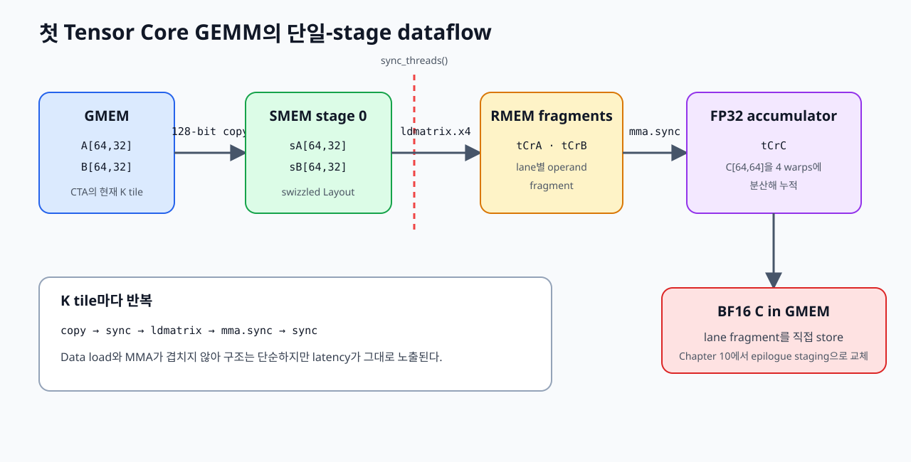

# 09. First tiled Tensor Core GEMM

이 장에서는 Chapter 08의 `TiledMMA`를 사용해 첫 BF16 GEMM을 완성합니다.

```text
C[M,N] = A[M,K] × B[N,K]ᵀ
```

A와 B는 BF16이고 `mma.sync`는 FP32 register에 누적합니다. 마지막에 결과를 BF16 C로 변환합니다. Kernel은 GMEM→SMEM copy, SMEM→RMEM `ldmatrix`, Tensor Core MMA, C store를 순서대로 실행합니다.



*Figure 9-1. CTA가 A/B의 K tile을 shared memory에 적재한 뒤 `ldmatrix.x4`로 register fragment를 만들고 `mma.sync`로 C를 누적한다.*

실행 가능한 전체 코드는 [`examples/09_tensor_core_gemm/tensor_core_gemm.py`](../examples/09_tensor_core_gemm/tensor_core_gemm.py)에 있습니다. 첫 구현의 dataflow를 분명하게 유지하기 위해 M, N, K는 각각 64, 64, 32의 배수로 제한합니다. Edge predication과 multistage pipeline은 아직 넣지 않습니다.

## 1. Kernel의 tile hierarchy

한 CTA가 C의 64×64를 맡고 K를 32개씩 처리합니다.

```python
CTA_M = 64
CTA_N = 64
CTA_K = 32
MMA_SHAPE_MNK = (16, 8, 16)
ATOM_LAYOUT_MNK = (2, 2, 1)
THREADS = 128
```

각 계층의 의미는 다음과 같습니다.

| 계층 | Shape | 실행 단위 |
|---|---:|---|
| CTA tile | `64×64×32` | 4 warps, 128 threads |
| TiledMMA | `32×16×16` | `(2,2,1)`로 배치한 4 warps |
| MMA atom | `16×8×16` | warp 하나의 `mma.sync` |
| C fragment | 32 FP32 values/thread | lane별 accumulator register |

C tile에는 `64×64=4,096`개 원소가 있습니다. 이를 128 threads에 분산하므로 thread 하나는 32개의 FP32 accumulator를 가집니다. 이 32개 coordinate는 연속된 직사각형이 아니라 `TiledMMA`가 정한 register fragment입니다.

CTA가 K tile 하나에서 수행하는 연산량은 다음과 같습니다.

```text
64 × 64 × 32 = 131,072 FMA
131,072 × 2  = 262,144 FLOP
```

`m16n8k16` 하나가 2,048 FMA를 수행하므로 CTA의 K tile 하나에는 총 64개의 warp-level MMA instruction이 필요합니다. 네 warp가 같은 양을 맡으면 warp당 16개입니다.

## 2. Host code에서 TiledMMA 만들기

`@cute.jit` function은 MMA operation과 atom Layout을 조합합니다.

```python
op = cute.nvgpu.warp.MmaF16BF16Op(
    cutlass.BFloat16,
    cutlass.Float32,
    MMA_SHAPE_MNK,
)
tiled_mma = cute.make_tiled_mma(
    op,
    atom_layout_mnk=ATOM_LAYOUT_MNK,
)
```

이 객체는 kernel argument로 전달됩니다. Dtype, instruction shape, atom Layout이 compile-time 값이므로 compiler는 `partition_A/B/C()`와 `cute.gemm()`을 실제 `ldmatrix`·`mma.sync` sequence로 내릴 수 있습니다.

## 3. A/B shared-memory Layout

CTA K tile 하나에 필요한 storage는 다음과 같습니다.

```text
A: 64 × 32 × 2 bytes = 4 KiB
B: 64 × 32 × 2 bytes = 4 KiB
합계                     8 KiB
```

BF16 여덟 개는 16 bytes입니다. Shared-memory Layout의 contiguous mode를 여덟 값 단위로 구성하고 Chapter 06에서 사용한 XOR swizzle을 적용합니다.

```python
base = cute.make_layout(
    (8, CTA_K),
    stride=(CTA_K, 1),
)
atom = cute.make_composed_layout(
    cute.make_swizzle(2, 3, 3),
    0,
    base,
)
sA_layout = cute.tile_to_shape(
    atom,
    (CTA_M, CTA_K, 1),
    (0, 1, 2),
)
```

마지막 shape의 `1`은 shared-memory stage가 하나라는 뜻입니다. K tile의 폭이 1이라는 뜻이 아닙니다. `sA[:, :, 0]`이 A의 현재 64×32 K tile을 저장합니다. B도 같은 방식으로 `64×32×1` Layout을 사용합니다.

Swizzle은 logical coordinate를 바꾸지 않습니다. Kernel은 계속 `(row,k)`로 접근하지만 physical shared-memory offset이 XOR mapping을 거칩니다. `ldmatrix`를 사용할 때 여러 lane의 주소가 같은 bank에 몰리는 것을 줄이기 위한 Layout입니다.

## 4. 128-bit TiledCopy

`CopyAtom`은 한 copy instruction의 폭을 정하고 `TiledCopy`는 그 instruction을 CTA의 thread와 value에 배치합니다.

```python
atom = cute.make_copy_atom(
    cute.nvgpu.CopyUniversalOp(),
    cutlass.BFloat16,
    num_bits_per_copy=128,
)

value_layout = cute.make_layout((1, 8))
gmem_tiled_copy = cute.make_tiled_copy_tv(
    atom,
    thread_layout,
    value_layout,
)
```

`value_layout=(1,8)`은 thread 하나의 copy가 contiguous BF16 여덟 개를 옮긴다는 뜻입니다.

```text
8 BF16 × 2 bytes = 16 bytes = 128 bits
```

A tile에는 2,048개 값이 있고 128 threads가 한 번에 1,024개 값을 옮깁니다. `partition_S()`와 `partition_D()`가 만드는 나머지 mode를 따라 thread당 두 packet을 처리하면 A tile 전체가 채워집니다. B도 같은 방식입니다.

## 5. `local_tile()`로 CTA의 matrix 범위 선택하기

Grid coordinate `(tile_m,tile_n)`을 받은 CTA는 A, B, C에서 다음 view를 만듭니다.

```python
gA = cute.local_tile(a, (CTA_M, CTA_K), (tile_m, None))
gB = cute.local_tile(b, (CTA_N, CTA_K), (tile_n, None))
gC = cute.local_tile(c, (CTA_M, CTA_N), (tile_m, tile_n))
```

`None`은 K tile mode를 남깁니다.

```text
gA: (64,32,num_k_tiles)
gB: (64,32,num_k_tiles)
gC: (64,64)
```

A와 B는 K tile을 반복해야 하므로 세 번째 mode가 남고, C는 CTA가 최종 결과 tile 하나를 담당하므로 64×64 view가 됩니다.

Input pointer는 16-byte aligned이고 K가 32의 배수라는 조건을 code에 전달합니다.

```python
gA = cute.make_tensor(gA.iterator.align(16), gA.layout)
gB = cute.make_tensor(gB.iterator.align(16), gB.layout)
```

`align(16)`은 pointer를 새 주소로 이동하지 않습니다. 이미 만족하는 alignment를 compiler에 알려 128-bit copy를 허용합니다. Runtime Tensor를 만들 때도 같은 조건을 사용해야 합니다.

## 6. GMEM과 SMEM을 thread별로 partition하기

TiledCopy에서 현재 thread의 slice를 선택한 뒤 source와 destination에 같은 mapping을 적용합니다.

```python
thr_copy = gmem_tiled_copy.get_slice(tid)
tAgA = thr_copy.partition_S(gA)
tAsA = thr_copy.partition_D(sA)
tBgB = thr_copy.partition_S(gB)
tBsB = thr_copy.partition_D(sB)
```

이름은 다음처럼 읽습니다.

| 이름 | 의미 |
|---|---|
| `tAgA` | thread-partitioned global A source view |
| `tAsA` | thread-partitioned shared A destination view |
| `tBgB` | thread-partitioned global B source view |
| `tBsB` | thread-partitioned shared B destination view |

`partition_S/D()`는 view만 만들고 data를 옮기지 않습니다. 다음 `cute.copy()`가 실제 copy를 실행합니다.

```python
cute.copy(
    gmem_tiled_copy,
    tAgA[None, None, None, k_tile],
    tAsA[None, None, None, 0],
)
```

Source의 마지막 coordinate는 global K tile 번호이고 destination의 마지막 coordinate는 shared-memory stage 번호입니다.

## 7. TiledMMA로 lane별 fragment 만들기

TiledMMA도 같은 방식으로 현재 thread의 slice를 선택합니다.

```python
thr_mma = tiled_mma.get_slice(tid)
tCsA = thr_mma.partition_A(sA)
tCsB = thr_mma.partition_B(sB)
tCgC = thr_mma.partition_C(gC)

tCrA = tiled_mma.make_fragment_A(tCsA[None, None, None, 0])
tCrB = tiled_mma.make_fragment_B(tCsB[None, None, None, 0])
tCrC = tiled_mma.make_fragment_C(tCgC)
tCrC.fill(0.0)
```

`tCsA`와 `tCsB`는 lane이 shared memory에서 읽어야 할 coordinate view입니다. `tCrA`와 `tCrB`는 MMA operand를 담는 register fragment입니다. `tCrC`는 C의 64×64를 128 threads에 분산한 FP32 accumulator입니다.

`make_fragment_A/B/C()`도 값을 load하지 않습니다. 필요한 register tensor의 Layout과 dtype을 만듭니다.

## 8. `ldmatrix`로 SMEM에서 RMEM으로 이동하기

`mma.sync`가 요구하는 lane/value 순서에 맞춰 A/B를 읽으려면 `TiledMMA`와 연결된 `TiledCopy`를 사용합니다.

```python
ldmatrix_atom = cute.make_copy_atom(
    cute.nvgpu.warp.LdMatrix8x8x16bOp(False, 4),
    cutlass.BFloat16,
)
s2r_copy_A = cute.make_tiled_copy_A(ldmatrix_atom, tiled_mma)
s2r_copy_B = cute.make_tiled_copy_B(ldmatrix_atom, tiled_mma)
```

`num_matrices=4`는 warp가 8×8 16-bit matrix 네 개를 load하는 `ldmatrix.x4` 경로를 선택합니다. `make_tiled_copy_A/B()`는 copy 결과의 thread-value Layout을 MMA operand fragment와 맞춥니다.

```python
thr_s2r_A = s2r_copy_A.get_slice(tid)
tCsA_copy = thr_s2r_A.partition_S(sA)
tCrA_copy = thr_s2r_A.retile(tCrA)
```

`retile(tCrA)`는 copy가 채울 수 있는 view로 같은 register fragment를 다시 봅니다. 새 register를 할당하거나 값을 복사하는 호출이 아닙니다.

## 9. 단일-stage mainloop

K tile마다 다음 순서를 반복합니다.

```python
for k_tile in cutlass.range(k_tiles, unroll=1):
    cute.copy(gmem_tiled_copy, gA_tile, sA_stage_0)
    cute.copy(gmem_tiled_copy, gB_tile, sB_stage_0)
    cute.arch.sync_threads()

    for k_block in cutlass.range_constexpr(k_blocks):
        cute.copy(s2r_copy_A, sA_block, rA_block)
        cute.copy(s2r_copy_B, sB_block, rB_block)
        cute.gemm(tiled_mma, tCrC, rA_block, rB_block, tCrC)

    cute.arch.sync_threads()
```

첫 번째 barrier는 CTA의 모든 thread가 A/B stage를 채울 때까지 기다립니다. 두 번째 barrier는 모든 warp가 현재 stage를 다 읽기 전에 다음 K tile이 같은 shared memory를 덮어쓰지 못하게 합니다.

`CTA_K=32`이고 instruction K가 16이므로 shared-memory K tile에는 두 개의 MMA K block이 있습니다.

```text
K block 0: k = 0..15
K block 1: k = 16..31
```

`cute.gemm()`은 `TiledMMA`와 fragment Layout을 보고 `mma.sync m16n8k16` instruction을 생성합니다. Python의 matrix multiplication을 runtime에 호출하는 것이 아닙니다.

## 10. 첫 epilogue는 accumulator를 직접 저장한다

K 전체를 처리하면 FP32 accumulator를 BF16 fragment로 변환합니다.

```python
tCrD = cute.make_fragment_like(tCrC, cutlass.BFloat16)
tCrD.store(tCrC.load().to(cutlass.BFloat16))
cute.autovec_copy(tCrD, tCgC)
```

이 경로는 lane-owned C coordinate를 global memory에 직접 저장합니다. Correctness를 확인하기에는 충분하지만 global store를 위한 lane mapping과 vector width를 별도로 설계하지 않았습니다. Chapter 10에서는 accumulator를 shared memory에 재배치한 뒤 contiguous packet으로 저장합니다.

## 11. Compile하고 실행하기

PyTorch tensor는 row-major `[M,K]`, `[N,K]`, `[M,N]`입니다. Compact K/N mode가 16-byte copy 조건을 만족한다는 사실을 함께 기록합니다.

```python
def as_cute_tensor(tensor, divisibility):
    return (
        from_dlpack(tensor, assumed_align=16)
        .mark_layout_dynamic(leading_dim=1)
        .mark_compact_shape_dynamic(mode=1, divisibility=divisibility)
    )
```

```bash
source ~/workspace/.venv_wsl/bin/activate
python examples/09_tensor_core_gemm/tensor_core_gemm.py \
  --m 256 --n 256 --k 256
```

```text
PASS: BF16 GEMM (256, 256, 256), FP32 accumulation
```

입력을 작은 정수로 만들기 때문에 product와 FP32 accumulation이 정확하고 BF16 output도 PyTorch reference와 bitwise 비교할 수 있습니다. 일반 random BF16 입력에서는 accumulation order가 달라질 수 있으므로 dtype에 맞는 tolerance를 정해야 합니다.

## 12. 생성된 instruction 확인하기

```bash
mkdir -p build/09_tensor_core_gemm
CUTE_DSL_NO_CACHE=1 \
CUTE_DSL_KEEP=ptx,cubin \
CUTE_DSL_DUMP_DIR=build/09_tensor_core_gemm \
python examples/09_tensor_core_gemm/tensor_core_gemm.py \
  --m 128 --n 128 --k 64

cuobjdump --dump-sass build/09_tensor_core_gemm/*.cubin \
  | grep -E 'HMMA|LDSM'
```

PTX에서는 다음 instruction 계열을 확인할 수 있습니다.

```text
ldmatrix.sync.aligned.m8n8.x4.shared.b16
mma.sync.aligned.m16n8k16.row.col.f32.bf16.bf16.f32
```

SM120 SASS에서는 각각 `LDSM.16.M88.4`와 `HMMA.16816.F32.BF16`으로 보입니다. PTX와 SASS의 이름은 다르지만 shared memory에서 MMA operand를 읽고 Tensor Core instruction을 실행하는 같은 경로입니다.

Instruction이 생성됐다는 사실만으로 kernel이 빠르다는 결론을 내릴 수는 없습니다. 이 장의 구현은 load와 compute를 직렬로 실행하고 direct epilogue를 사용합니다. 성능 비교는 pipeline과 epilogue를 구성한 뒤 같은 조건에서 별도로 측정해야 합니다.

## Summary

- CTA tile은 `64×64×32`, TiledMMA는 `32×16×16`입니다.
- `TiledCopy`는 128-bit copy atom을 128 threads에 배치합니다.
- `local_tile()`은 CTA가 담당할 A/B/C view와 K tile mode를 만듭니다.
- `partition_*()`와 `make_fragment_*()`는 Layout을 정하며 data를 이동하지 않습니다.
- `ldmatrix.x4`가 shared-memory operand를 MMA register fragment로 읽습니다.
- `cute.gemm()`이 BF16 `mma.sync`와 FP32 accumulation을 생성합니다.
- 단일 shared-memory stage에서는 copy, barrier, MMA가 순서대로 실행됩니다.

## References

1. [NVIDIA, `tensorop_gemm.py`, CUTLASS 4.6.1](https://github.com/NVIDIA/cutlass/blob/4ca61d0662bbc835c98dccfca022c8265edd9022/examples/python/CuTeDSL/ampere/tensorop_gemm.py)
2. [NVIDIA, “Warp-level Matrix Multiply-Accumulate Programming”](https://docs.nvidia.com/cutlass/latest/media/docs/pythonDSL/mma_docs/wmma_programming.html)
3. [NVIDIA, “CuTe GEMM Tutorial”](https://docs.nvidia.com/cutlass/latest/media/docs/cpp/cute/0x_gemm_tutorial.html)
4. [NVIDIA, “Parallel Thread Execution ISA,” `ldmatrix` and `mma`](https://docs.nvidia.com/cuda/parallel-thread-execution/#warp-level-matrix-instructions)
