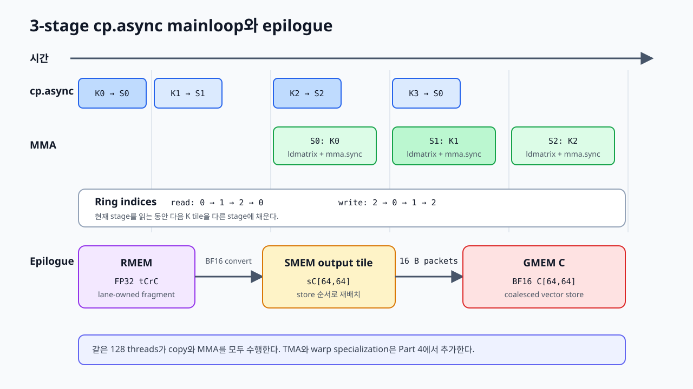

# 10. Multistage GEMM and epilogue

Chapter 09의 kernel은 K tile마다 다음 작업을 순서대로 실행합니다.

```text
GMEM→SMEM copy → CTA barrier → ldmatrix → mma.sync → CTA barrier
```

현재 K tile을 계산하는 동안 memory pipeline은 다음 tile을 준비하지 않습니다. 이 장에서는 A/B shared-memory buffer를 세 개로 늘리고 `cp.async`로 다음 K tile을 미리 가져옵니다. Mainloop가 끝난 뒤에는 lane별 accumulator를 shared memory에 재배치하고 C를 16-byte packet으로 저장합니다.



*Figure 10-1. 세 shared-memory stage를 순환하며 다음 K tile의 `cp.async`와 현재 tile의 MMA를 겹치고, accumulator를 output tile로 재배치해 저장한다.*

실행 가능한 전체 코드는 [`examples/10_multistage_gemm/multistage_gemm.py`](../examples/10_multistage_gemm/multistage_gemm.py)에 있습니다. Chapter 09와 같은 `64×64×32` CTA tile, `(2,2,1)` TiledMMA, 128 threads를 사용해 pipeline과 epilogue의 변화만 비교합니다.

## 1. Stage는 tile 크기가 아니라 buffer 개수다

Chapter 09의 shared-memory Layout은 `(64,32,1)`이었습니다. 이 장에서는 마지막 mode를 3으로 바꿉니다.

```python
STAGES = 3
sA_layout = cute.tile_to_shape(
    atom,
    (CTA_M, CTA_K, STAGES),
    (0, 1, 2),
)
```

각 stage는 크기가 같은 A/B K tile 하나를 저장합니다.

```text
sA[:, :, 0] → A K tile 하나
sA[:, :, 1] → A K tile 하나
sA[:, :, 2] → A K tile 하나
```

Stage 수를 늘려도 CTA tile은 계속 `64×64×32`입니다. 한 번의 MMA mainloop iteration이 처리하는 K 범위도 32입니다. 달라지는 것은 동시에 shared memory에 둘 수 있는 K tile의 수입니다.

A/B pipeline의 shared-memory 사용량은 다음과 같습니다.

```text
A: 64 × 32 × 2 bytes × 3 stages = 12 KiB
B: 64 × 32 × 2 bytes × 3 stages = 12 KiB
합계                                      24 KiB
```

Epilogue의 C tile 8 KiB를 더하면 이 예제의 CTA당 shared memory는 32 KiB입니다. Stage를 늘리면 더 먼 global-memory latency를 가릴 수 있지만 shared-memory 사용량이 증가해 resident CTA 수가 줄 수 있습니다.

## 2. `cp.async` CopyAtom

Chapter 09의 synchronous copy atom을 non-bulk `cp.async` operation으로 교체합니다.

```python
g2s_atom = cute.make_copy_atom(
    cute.nvgpu.cpasync.CopyG2SOp(
        cache_mode=cute.nvgpu.cpasync.LoadCacheMode.GLOBAL
    ),
    cutlass.BFloat16,
    num_bits_per_copy=128,
)
```

Copy width는 그대로 128 bits입니다. Thread 하나가 aligned BF16 여덟 개를 global memory에서 shared memory로 옮깁니다.

`cp.async`는 copy를 발행한 thread의 일반 register에 값을 담았다가 shared memory에 store하는 경로를 사용하지 않습니다. Copy가 비동기로 진행되므로 발행과 완료를 구분해야 합니다.

```python
cute.copy(gmem_tiled_copy, gA_tile, sA_stage)
cute.copy(gmem_tiled_copy, gB_tile, sB_stage)
cute.arch.cp_async_commit_group()
```

`commit_group()`은 앞에서 발행한 copy들을 하나의 완료 단위로 묶습니다. 이후 `wait_group(n)`은 아직 완료되지 않은 group이 최대 `n`개가 될 때까지 현재 warp를 기다리게 합니다.

`cp.async` 완료는 copy를 발행한 warp 관점의 조건입니다. CTA의 다른 warp가 shared-memory 결과를 안전하게 읽게 하려면 `sync_threads()`도 필요합니다.

## 3. Prologue에서 두 stage를 먼저 채우기

Mainloop에 들어가기 전에 stage 0과 1을 채웁니다.

```python
for stage in cutlass.range_constexpr(STAGES - 1):
    if stage < k_tiles:
        cute.copy(gmem_tiled_copy, gA[stage], sA[stage])
        cute.copy(gmem_tiled_copy, gB[stage], sB[stage])
        cute.arch.cp_async_commit_group()
```

세 stage를 모두 채우지 않고 하나를 비워 두는 이유는 mainloop에서 다음 K tile을 쓸 destination이 필요하기 때문입니다.

```text
read stage:  0
prefetched:  1
write stage: 2
```

이 시점에서 stage 0과 1의 copy가 진행될 수 있고 stage 2는 비어 있습니다.

## 4. Read와 write index를 ring으로 이동하기

세 stage는 다음 순서로 재사용됩니다.

```python
read_stage = cutlass.Int32(0)
write_stage = cutlass.Int32(STAGES - 1)
next_k_tile = cutlass.Int32(STAGES - 1)
```

각 mainloop iteration이 끝나면 index를 하나씩 증가시키고 3에서 0으로 되돌립니다.

```text
iteration 0: read 0, write 2
iteration 1: read 1, write 0
iteration 2: read 2, write 1
iteration 3: read 0, write 2
```

현재 iteration이 stage 0을 읽는 동안 producer는 stage 2에 다음 K tile을 씁니다. 두 iteration 뒤에 stage 0을 다시 쓰기 전에는 CTA의 모든 warp가 이전 값을 다 읽었는지 확인해야 합니다.

## 5. Steady-state wait와 tail wait

다음 K tile이 남아 있을 때는 한 newer group이 계속 진행되도록 `wait_group(1)`을 사용합니다.

```python
has_next_tile = next_k_tile < k_tiles
if has_next_tile:
    cute.arch.cp_async_wait_group(STAGES - 2)  # wait_group(1)
else:
    cute.arch.cp_async_wait_group(0)
cute.arch.sync_threads()
```

`wait_group(1)`은 가장 오래된 stage가 완료됐다는 조건을 만들면서 더 새로운 copy 하나는 진행 중인 상태로 둘 수 있습니다. 따라서 consumer는 현재 stage를 읽고, copy pipeline은 다음 stage를 채울 수 있습니다.

마지막 K tile들에서는 더 이상 새 group을 발행하지 않습니다. 이때 pending group 수를 일정하게 유지할 수 없으므로 `wait_group(0)`으로 남은 copy를 모두 완료합니다. Steady state와 tail에서 같은 wait 값을 무조건 사용하면 아직 완료되지 않은 마지막 stage를 읽을 수 있습니다.

## 6. 다음 tile을 발행한 뒤 현재 tile 계산하기

현재 read stage가 준비되면 빈 write stage에 다음 K tile을 발행합니다.

```python
if has_next_tile:
    cute.copy(
        gmem_tiled_copy,
        tAgA[None, None, None, next_k_tile],
        tAsA[None, None, None, write_stage],
    )
    cute.copy(
        gmem_tiled_copy,
        tBgB[None, None, None, next_k_tile],
        tBsB[None, None, None, write_stage],
    )
    cute.arch.cp_async_commit_group()
    next_k_tile += 1
```

그다음 현재 `read_stage`의 A/B를 `ldmatrix`로 읽고 MMA를 실행합니다. GPU는 instruction dependency와 hardware pipeline이 허용하는 범위에서 다음 `cp.async`와 현재 MMA를 겹쳐 진행할 수 있습니다.

```text
cp.async: 다음 K tile → write stage
ldmatrix: 현재 read stage → A/B register
mma.sync: 현재 A/B register → FP32 accumulator
```

`cp.async`를 사용했다는 사실만으로 overlap이 보장되지는 않습니다. 너무 일찍 `wait_group(0)`을 실행하거나 barrier를 배치하면 copy가 끝날 때까지 compute를 시작하지 못해 Chapter 09와 같은 직렬 구조가 됩니다.

## 7. Register pipeline

CTA K tile의 폭은 32이고 MMA instruction의 K는 16이므로 stage 하나에는 두 K block이 있습니다. 첫 block을 먼저 register에 load합니다.

```python
cute.copy(
    s2r_copy_A,
    tCsA_copy[None, None, 0, read_stage],
    tCrA_copy[None, None, 0],
)
cute.copy(
    s2r_copy_B,
    tCsB_copy[None, None, 0, read_stage],
    tCrB_copy[None, None, 0],
)
```

Mainloop에서는 현재 block을 MMA에 사용하기 전에 다음 block의 `ldmatrix`를 발행합니다.

```python
for k_block in cutlass.range_constexpr(k_blocks):
    if k_block + 1 < k_blocks:
        cute.copy(s2r_copy_A, sA_next, rA_next)
        cute.copy(s2r_copy_B, sB_next, rB_next)

    cute.gemm(
        tiled_mma,
        tCrC,
        tCrA[None, None, k_block],
        tCrB[None, None, k_block],
        tCrC,
    )
```

이 순서는 다음 A/B fragment를 준비하는 instruction과 현재 MMA 사이에 독립적인 작업을 만듭니다. Shared-memory pipeline은 K tile 단위의 GMEM→SMEM 이동을 겹치고, register pipeline은 K block 단위의 SMEM→RMEM 이동과 MMA를 겹칩니다.

현재 stage의 마지막 MMA가 끝나면 CTA barrier를 실행합니다.

```python
cute.arch.sync_threads()
```

이 barrier는 다음 loop에서 producer thread가 방금 소비한 stage를 덮어쓰기 전에 모든 warp의 shared-memory read가 끝났음을 보장합니다.

## 8. Mainloop와 epilogue의 Layout이 다른 이유

MMA가 끝난 `tCrC`는 `mma.sync`가 요구하는 lane/value 순서입니다. Global C는 row-major이므로 같은 lane이 보유한 값을 그대로 store하면 warp의 주소가 연속되지 않을 수 있습니다.

Epilogue는 계산에 맞춘 register Layout을 저장에 맞춘 Layout으로 바꾸는 구간입니다.

```text
FP32 accumulator in RMEM
  → BF16 변환
  → C tile in SMEM
  → 16-byte packets in RMEM
  → row-major C in GMEM
```

이 예제는 C의 64×64 shared-memory tile에 단순 row-major Layout을 사용합니다.

```python
sC_layout = cute.make_layout(
    (CTA_M, CTA_N),
    stride=(CTA_N, 1),
)
```

Mainloop의 A/B처럼 swizzle을 넣지 않은 이유는 첫 epilogue에서 RMEM→SMEM coordinate 변환과 vector store를 직접 확인하기 위해서입니다. 이 선택은 가장 빠른 epilogue라는 뜻이 아닙니다. Production kernel에서는 accumulator Layout, bank conflict, `stmatrix`, output dtype에 맞춘 composed Layout을 별도로 설계합니다.

## 9. RMEM에서 shared-memory output tile로 이동하기

먼저 FP32 accumulator를 BF16 fragment로 변환합니다.

```python
tCrD = cute.make_fragment_like(tCrC, cutlass.BFloat16)
tCrD.store(tCrC.load().to(cutlass.BFloat16))
```

`tCsC`는 `thr_mma.partition_C(sC)`로 만든 view입니다. 각 lane의 C coordinate를 shared-memory output tile에 적용합니다.

```python
cute.autovec_copy(tCrD, tCsC)
cute.arch.sync_threads()
```

Barrier 전에는 어떤 thread가 shared memory를 다 썼는지 알 수 없습니다. 이후의 vector-copy mapping은 다른 thread가 기록한 값도 읽을 수 있으므로 CTA 전체 synchronization이 필요합니다.

## 10. Shared memory에서 C를 16-byte packet으로 저장하기

C용 TiledCopy도 BF16 여덟 개를 한 packet으로 처리합니다.

```python
c_atom = cute.make_copy_atom(
    cute.nvgpu.CopyUniversalOp(),
    cutlass.BFloat16,
    num_bits_per_copy=128,
)
c_tiled_copy = make_tiled_copy(c_atom, CTA_N)
```

현재 thread의 source와 destination view를 만듭니다.

```python
thr_copy_C = c_tiled_copy.get_slice(tid)
tCsC_epilogue = thr_copy_C.partition_S(sC)
tCgC_epilogue = thr_copy_C.partition_D(gC)
tCrC_epilogue = cute.make_fragment_like(tCsC_epilogue)
```

Shared memory에서 register packet으로 읽은 뒤 global memory에 저장합니다.

```python
cute.autovec_copy(tCsC_epilogue, tCrC_epilogue)
cute.copy(c_tiled_copy, tCrC_epilogue, tCgC_epilogue)
```

C tile에는 4,096 BF16 values가 있습니다. Packet 하나가 여덟 값을 담으므로 총 512 packets이고, 128 threads가 thread당 네 packet을 저장합니다. 같은 warp의 lane들이 row-major C의 연속된 16-byte 구간을 담당하도록 TiledCopy가 배치됩니다.

## 11. Chapter 09와 달라진 경로

| 항목 | Chapter 09 | Chapter 10 |
|---|---|---|
| A/B stage | 1 | 3 |
| GMEM→SMEM | synchronous universal copy | 128-bit `cp.async` |
| Mainloop | copy와 MMA 직렬 | 다음 tile copy와 현재 MMA overlap |
| SMEM→RMEM | `ldmatrix.x4` | `ldmatrix.x4`와 next-block prefetch |
| C store | lane fragment에서 직접 store | RMEM→SMEM 재배치 후 16-byte store |
| CTA threads | 128 | 128 |
| TiledMMA | `32×16×16` | `32×16×16` |

이 표는 구조 차이입니다. 두 예제의 latency나 throughput을 측정한 결과가 아닙니다. Multistage가 항상 빠르다고 단정할 수도 없습니다. K가 짧으면 prologue와 synchronization 비용이 더 클 수 있고, stage 증가로 occupancy가 낮아질 수 있습니다.

## 12. Compile하고 실행하기

```bash
source ~/workspace/.venv_wsl/bin/activate
python examples/10_multistage_gemm/multistage_gemm.py \
  --m 256 --n 256 --k 256
```

```text
PASS: 3-stage BF16 GEMM (256, 256, 256), FP32 accumulation
```

이 예제는 prologue에서 최소 두 K tile을 채우므로 K는 64 이상이어야 합니다. M, N, K는 각각 64, 64, 32의 배수여야 합니다.

생성된 instruction을 확인하려면 다음과 같이 dump합니다.

```bash
mkdir -p build/10_multistage_gemm
CUTE_DSL_NO_CACHE=1 \
CUTE_DSL_KEEP=ptx,cubin \
CUTE_DSL_DUMP_DIR=build/10_multistage_gemm \
python examples/10_multistage_gemm/multistage_gemm.py \
  --m 128 --n 128 --k 128

cuobjdump --dump-sass build/10_multistage_gemm/*.cubin \
  | grep -E 'LDGSTS|LDSM|HMMA'
```

PTX에서는 다음 경로를 확인합니다.

```text
cp.async ... shared.global
ldmatrix ... x4 ... shared.b16
mma.sync ... m16n8k16 ... bf16 ... f32
```

SM120 SASS에서는 이 경로가 각각 `LDGSTS`, `LDSM`, `HMMA` instruction으로 나타납니다. 특히 `LDGSTS.E...128`은 16-byte `cp.async` copy가 register의 일반 load/store 경로를 거치지 않고 global memory에서 shared memory로 이동했음을 보여 줍니다.

## 13. 아직 남아 있는 한계

이 장의 kernel은 pipeline 구조를 분리해 읽기 위한 구현입니다.

- Edge tile predication이 없어 고정 tile 배수 shape만 처리합니다.
- 같은 128 threads가 copy와 MMA를 모두 실행합니다.
- `cp.async` group과 CTA barrier를 직접 관리합니다.
- Epilogue의 plain shared-memory Layout은 bank conflict까지 최적화하지 않았습니다.
- CTA scheduling, rasterization, Split-K가 없습니다.
- Alpha, beta, bias, activation을 epilogue에 fuse하지 않습니다.

Part 4에서는 global-memory copy를 TMA로 바꾸고 `mbarrier`가 stage의 full/empty 상태를 관리하게 합니다. Producer warp와 MMA consumer warp를 분리한 뒤 persistent scheduling으로 CTA가 여러 output tile을 처리하도록 확장합니다.

## Summary

- Stage는 같은 K tile storage를 여러 벌 두는 pipeline buffer 수입니다.
- `cp.async`는 aligned GMEM→SMEM copy를 비동기로 발행합니다.
- `commit_group()`과 `wait_group()`은 copy group의 발행과 완료 조건을 구분합니다.
- 세 stage의 read/write index를 ring으로 이동해 overwrite를 방지합니다.
- Shared-memory pipeline과 register pipeline은 서로 다른 범위의 latency를 겹칩니다.
- Epilogue는 MMA accumulator Layout을 global-store Layout으로 바꿉니다.
- 이 예제는 vectorized global store를 구현하지만 production epilogue의 최종 형태는 아닙니다.

## References

1. [NVIDIA, `tensorop_gemm.py`, CUTLASS 4.6.1](https://github.com/NVIDIA/cutlass/blob/4ca61d0662bbc835c98dccfca022c8265edd9022/examples/python/CuTeDSL/ampere/tensorop_gemm.py)
2. [NVIDIA, CuTe DSL `nvgpu.cpasync` API](https://docs.nvidia.com/cutlass/latest/media/docs/pythonDSL/cute_dsl_api/cute_nvgpu_cpasync.html)
3. [NVIDIA, “Parallel Thread Execution ISA,” `cp.async`](https://docs.nvidia.com/cuda/parallel-thread-execution/#data-movement-and-conversion-instructions-cp-async)
4. [NVIDIA, “CUDA C++ Programming Guide,” Asynchronous Data Copies](https://docs.nvidia.com/cuda/cuda-c-programming-guide/#asynchronous-data-copies)
5. [NVIDIA, “CuTe Tensor Algorithms”](https://docs.nvidia.com/cutlass/latest/media/docs/cpp/cute/04_algorithms.html)
